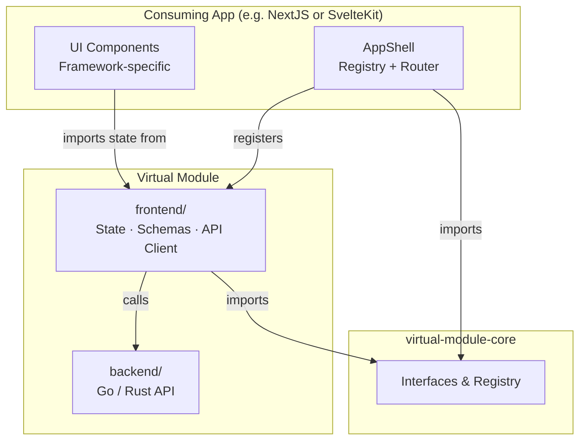

# AppShell Architecture

This document describes the **AppShell Architecture**: how ReactiveX state management and backend (Go/Rust) appshells enable virtual (feature) modules to be dynamically injected at runtime, **without any UI kit dependency in the module itself**.

## Overview

The AppShell pattern provides a **host application** that loads and orchestrates virtual (feature) modules at runtime. Each virtual module ships:

- A **`frontend/`** package — pure TypeScript state management, Zod schemas, and API clients (no UI framework or UI kit dependency)
- A **`backend/`** package — Go or Rust API implementation

The consuming application (NextJS, SvelteKit, or Flutter) imports the module's `frontend/` package and provides its own UI layer on top.



---

## Core Architectural Principles

The AppShell Architecture is built upon **SOLID principles** and **Dependency Injection (DI)**.

### SOLID Principles

| Principle                 | Application in AppShell                                                                                                                                                             |
| :------------------------ | :---------------------------------------------------------------------------------------------------------------------------------------------------------------------------------- |
| **S**ingle Responsibility | Each **Virtual Module** focuses on a specific business domain. The **AppShell** focuses solely on orchestration and common infra.                                                   |
| **O**pen/Closed           | The **AppShell** is open for extension (load any number of new modules) but closed for modification (core shell code doesn't change to add features).                               |
| **L**iskov Substitution   | Every module must satisfy the `IModuleBundle` interface. The Shell handles any conforming bundle without knowing the concrete module type.                                          |
| **I**nterface Segregation | Consumers depend only on specific, small interfaces (`IHandler`, `IStatePackage`) — modules are not forced to implement unnecessary logic.                                          |
| **D**ependency Inversion  | High-level AppShell logic depends on **abstractions** (interfaces in `virtual-module-core`), not on concrete frontend frameworks or UI kits.                                        |

### Dependency Injection (DI)

#### Frontend DI (Registry)

The **`Registry`** acts as a lightweight DI container for module state and handlers.

- **Provider**: Modules register their state instances and handlers during the `init` phase.
- **Consumer**: App-shell and UI components inject state by requesting it from the Registry.
- **Benefit**: Swap real state for mock state in tests without touching consuming components.

#### Backend DI (Go/Rust)

In the Go or Rust backend, DI is handled at server startup:

- **Service Wiring**: The server entrypoint instantiates concrete service implementations and passes them into the generated endpoints.
- **Decoupling**: The transport layer (HTTP/gRPC) is decoupled from business logic, enabling isolated unit tests via mock database clients.

---

## Module Interfaces (`virtual-module-core`)

All virtual modules implement `IModuleBundle`. There are **no UI types in these interfaces** — widget layout, component mapping, and rendering are entirely the consuming app's responsibility.

```typescript
// virtual-module-core/src/types/index.ts

export interface IModuleBundle {
  id: string;
  handlers?: IHandler[];
  state?: Record<string, unknown>;  // Exported state instances
  routes?: IRouteDescriptor[];      // Route paths only — no page components
  metadata?: Record<string, unknown>;
}

export interface IHandler {
  id: string;
  title: string;
  execute: (context: IContext) => void | Promise<void>;
}

export interface IRouteDescriptor {
  path: string;  // e.g. '/portfolio'
}

export type ModuleInit = (context: IContext) => Promise<IModuleBundle>;
```

### Registry Singleton

```typescript
export class Registry {
  private static instance: Registry;
  private modules = new Map<string, IModuleBundle>();
  private stateIndex = new Map<string, unknown>();
  private routeIndex = new Map<string, IRouteDescriptor>();

  register(bundle: IModuleBundle): void {
    this.modules.set(bundle.id, bundle);
    for (const [key, val] of Object.entries(bundle.state ?? {})) {
      this.stateIndex.set(key, val);
    }
    for (const route of bundle.routes ?? []) {
      this.routeIndex.set(route.path, route);
    }
  }

  getState<T>(key: string): T {
    return this.stateIndex.get(key) as T;
  }

  getRoutes(): IRouteDescriptor[] {
    return [...this.routeIndex.values()];
  }
}
```

---

## Module Lifecycle

### 1. Discovery Phase

The `ModuleLoader` discovers module entry points from the `modules/` directory or from installed packages.

```typescript
// apps/[appshell]/src/lib/loader/ModuleLoader.ts
static async loadModules(context: IContext, config: IAppConfig[]): Promise<void> {
  for (const moduleConfig of config) {
    if (!moduleConfig.enabled) continue;
    const module = await import(moduleConfig.packageName);
    const initFn = module.init;
    if (typeof initFn === 'function') {
      const bundle = await initFn(context);
      registry.register(bundle);
    }
  }
}
```

### 2. Initialization Phase

Each module's `init(context)` function:
- Creates or exports its state instances
- Returns an `IModuleBundle` with metadata and state references

### 3. Registration Phase

The Registry stores the bundle, indexing state instances and route descriptors.

### 4. Runtime Integration

The consuming app pulls state from the Registry and wires it into its own UI components. The module has no knowledge of how or where it is rendered.

---

## Module `init()` Entry Point

```typescript
// modules/[module_name]/frontend/src/index.ts
import { watchlistState } from './states/WatchlistState';

export const init: ModuleInit = async (_context) => {
  return {
    id: '[module_name]',
    state: {
      watchlistState,  // State instance — no UI framework dependency
    },
    routes: [
      { path: '/watchlist' },
    ],
    handlers: [
      {
        id: 'refresh-watchlist',
        title: 'Refresh Watchlist',
        execute: async () => watchlistState.fetch(),
      },
    ],
  };
};
```

---

## Integrating Module State into Consuming Apps

The module's `frontend/` package exports pure TypeScript state — no UI kit. Each consuming framework accesses that state through its own reactivity model.

### SvelteKit Integration

```typescript
// apps/sveltekit-appshell/src/routes/dashboard/+page.svelte
<script lang="ts">
  import { registry } from '$lib/registry';
  import type { WatchlistState } from '@my-org/watchlist-virtmod/frontend';

  // Retrieve state from registry (populated during init)
  const watchlistState = registry.getState<WatchlistState>('watchlistState');

  // SvelteKit reactivity is driven by $state inside WatchlistState — no extra wiring needed
</script>

<WatchlistWidget state={watchlistState} />
```

### NextJS Integration

```tsx
// apps/nextjs-appshell/src/app/dashboard/page.tsx
'use client';
import { useEffect, useState } from 'react';
import { registry } from '@/lib/registry';
import type { WatchlistState } from '@my-org/watchlist-virtmod/frontend';

export default function DashboardPage() {
  const state = registry.getState<WatchlistState>('watchlistState');

  useEffect(() => {
    state.fetch();
  }, []);

  // Wrap in a React adapter that subscribes to the state's observable/signal
  return <WatchlistWidget state={state} />;
}
```

### Flutter Integration

```dart
// apps/flutter-appshell/lib/dashboard_screen.dart
// The Dart/Flutter counterpart imports state logic via the backend API client
// The module's backend/ exposes gRPC or REST; Flutter consumes it directly
import 'package:watchlist_module/watchlist_service.dart';

class DashboardScreen extends StatelessWidget {
  final _service = WatchlistService();

  @override
  Widget build(BuildContext context) {
    return StreamBuilder(
      stream: _service.tickers$,
      builder: (context, snapshot) => WatchlistWidget(tickers: snapshot.data ?? []),
    );
  }
}
```

---

## Backend AppShell (Go / Rust)

### Go with Goa

[Goa](https://goa.design) provides a **design-first** API framework:

| Feature              | Benefit                                           |
| -------------------- | ------------------------------------------------- |
| DSL-based Design     | API contracts in Go code, not YAML/JSON           |
| Code Generation      | Server stubs, clients, OpenAPI specs auto-generated |
| Type Safety          | Compile-time validation of request/response types |
| Transport Agnostic   | HTTP, gRPC, or WebSocket from one design          |

```go
// modules/portfolio/backend/design/portfolio.go
var _ = Service("portfolio", func() {
    Method("list", func() {
        Payload(func() {
            Attribute("user_id", String)
            Required("user_id")
        })
        Result(ArrayOf(Insight))
        HTTP(func() {
            GET("/portfolio")
            Header("user_id:X-User-ID")
        })
    })
})
```

### Extending to MCP Servers (goa-ai)

```go
// apps/mcp-server/design/design.go
var _ = ai.Agent("ta-assistant", func() {
    ai.Tool("get-watchlist", func() {
        ai.Description("Retrieve user's stock watchlist")
        ai.ToolService(WatchlistService)
    })
    ai.Tool("get-portfolio-insights", func() {
        ai.Description("Get AI-generated portfolio insights")
        ai.ToolService(PortfolioService)
    })
})
```

### Service Injection

```go
// apps/go-server/cmd/api-server.go
import (
    portfolio "github.com/reidlai/ta-workspace/modules/portfolio/backend/pkg"
    watchlist "github.com/reidlai/ta-workspace/modules/watchlist/backend/pkg"
)

services := di.NewServices(logger)
HandleHTTPServer(ctx, u, services.WatchlistEndpoints, services.PortfolioEndpoints)
```

---

## State Management Patterns by Framework

### SvelteKit — Svelte 5 Runes

The module's `frontend/` state classes use Svelte 5 Runes natively (since the package targets SvelteKit consumers):

```typescript
// modules/[module_name]/frontend/src/states/[Module]State.svelte.ts
export class [Module]State {
  data = $state<Item[]>([]);
  loading = $state(false);
  isReady = $derived(this.data.length > 0);

  async fetch() {
    this.loading = true;
    this.data = await api.getItems();
    this.loading = false;
  }
}
export const [module]State = new [Module]State();
```

### NextJS — React Hooks Adapter

Since the module's state is plain TypeScript, wrap it in a React hook in the consuming app:

```typescript
// apps/nextjs-appshell/src/hooks/useWatchlist.ts
import { watchlistState } from '@my-org/watchlist-virtmod/frontend';
import { useSyncExternalStore } from 'react';

export function useWatchlist() {
  // Subscribe to the state's subscribe() method (module exposes standard observable)
  const data = useSyncExternalStore(watchlistState.subscribe, () => watchlistState.data);
  return { data, loading: watchlistState.loading, fetch: watchlistState.fetch };
}
```

### Flutter — Dart HTTP Client

For Flutter, the module's `backend/` exposes an OpenAPI spec. Generate a Dart client from it:

```dart
// Generated from module's OpenAPI spec
// modules/watchlist/backend/goa_gen/http/openapi3.json → Dart client
import 'package:watchlist_client/watchlist_client.dart';

class WatchlistService {
  final _client = WatchlistClient(baseUrl: 'https://api.example.com');
  final _tickers$ = BehaviorSubject<List<TickerItem>>.seeded([]);

  Stream<List<TickerItem>> get tickers$ => _tickers$.stream;

  Future<void> fetch() async {
    final items = await _client.listTickers();
    _tickers$.add(items);
  }
}
```

---

## Summary

| Layer               | Virtual Module Provides              | Consuming App Provides               |
| ------------------- | ------------------------------------ | ------------------------------------ |
| **State**           | State classes (TS, no UI kit)        | Reactivity wiring per framework      |
| **API Client**      | Zodios / generated client            | —                                    |
| **Schemas**         | Zod schemas (SSOT)                   | —                                    |
| **Routes**          | Path strings                         | Route handler / page component       |
| **Handlers**        | Command definitions                  | Trigger (menu, keyboard, etc.)       |
| **Backend**         | Go/Rust service + OpenAPI spec       | Server hosting + DI wiring           |
| **UI / Widgets**    | —                                    | All components, layout, placement    |

## Module Workflow Tooling

| Command                   | Description                                                          |
| ------------------------- | -------------------------------------------------------------------- |
| `moon run :add-module`    | Adds a new virtual module, updates registry and workspace configs.   |
| `moon run :delete-module` | Removes a module, cleaning up git submodules and config references.  |
| `moon run :rename-module` | Renames a module, refactoring internal imports and names.            |

The tooling manages:
1. **Registry**: `apps/[appshell]/src/lib/module-registry.ts`
2. **Node Workspace**: `pnpm-workspace.yaml`
3. **Go Workspace**: `go.work`
4. **Git Submodules**: `.gitmodules`, `.git/config`
