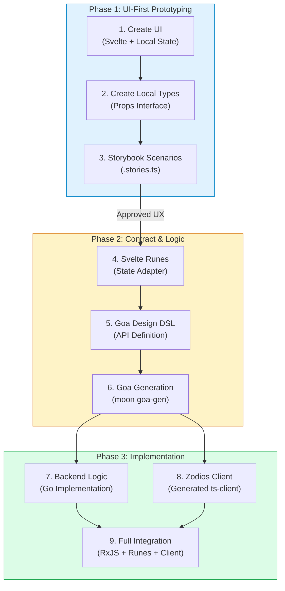

# Developer Guide: Virtual Module Development

This guide provides a comprehensive "build from scratch" walkthrough for developing **Polyglot Virtual Modules**. It follows a strictly phased **UI-First** workflow to ensure that backend APIs satisfy frontend requirements without waste.

---

## 🚀 Standard Development Workflow

The 9-step sequence below is the definitive standard for all feature development.



---

## 🛠️ Prerequisites & Toolchain

Before you begin, ensure the following tools are installed and configured in your environment.

### 1. Go Ecosystem (Backend)
- **Go 1.24+**: The primary backend language.
- **`golangci-lint`**: The standard linter to catch quality issues early.
- **`goimports`**: Automated import management and formatting.
- **`gosec`**: Security scanner for Go code (SAST).
- **`goa`**: The API design and code generation tool.

```bash
# Install Go utilities
go install github.com/golangci/golangci-lint/cmd/golangci-lint@latest
go install golang.org/x/tools/cmd/goimports@latest
go install github.com/securego/gosec/v2/cmd/gosec@latest
go install goa.design/goa/v3/cmd/goa@latest
```

### 2. TypeScript & Node Ecosystem (Shared & Frontend)
- **Node.js 20+ (LTS)**: JavaScript runtime.
- **`pnpm`**: The mandatory package manager for this monorepo.
- **`tsc`**: TypeScript compiler for the `ts/` layer.
- **`RxJS 7+`**: Reactive programming library for shared services.
- **`eslint` & `prettier`**: Pluggable linting and formatting.

```bash
# Install global utilities
npm install -g pnpm
```

### 3. SvelteKit Ecosystem (UI)
- **Svelte 5**: The reactive framework (Runes).
- **SvelteKit 2**: The application framework.
- **Tailwind CSS v4**: The utility-first CSS framework (Vite plugin).
- **ShadCN Svelte**: UI component library.
- **Vitest**: Unit testing framework.
- **Storybook**: Component development environment.
- **`svelte-check`**: Diagnostic tool for Svelte files.

---

## ⚙️ Core Configuration Basics

### 1. TypeScript (`tsconfig.json`)
We use a hierarchical `tsconfig` pattern. Each layer inherits from a base configuration to ensure consistency:
- **`tsconfig.base.json`**: Root-level shared compiler options.
- **`ts/tsconfig.json`**: Specific rules for the shared RxJS library.
- **`sveltekit/tsconfig.json`**: Rules tailored for SvelteKit and Vite.

### 2. Svelte Config (`svelte.config.js`)
Configures the Svelte compiler and SvelteKit adapters. Crucial for:
- **Aliases**: Mapping `@modules/[name]-ts` to local paths for cross-layer imports.
- **Preprocessors**: Enabling `vitePreprocess` for TypeScript and Tailwind support.

### 3. SvelteKit 2 & ShadCN Svelte Foundation
This project uses **SvelteKit 2** with **ShadCN Svelte** components and **Tailwind CSS v4**.

- **`app.html`**: The primary HTML template for SvelteKit. It includes `%sveltekit.head%` and `%sveltekit.body%` placeholders.
- **`app.css`**: The global styling entry point. It imports Tailwind CSS v4 (`@import "tailwindcss";`) and defines ShadCN-compatible design tokens in the `@theme` block.
- **`app.d.ts`**: Global TypeScript declarations for the SvelteKit environment, including custom module mocks (e.g., `$app/navigation`).
- **`vite.config.ts`**: The Vite configuration where the `@tailwindcss/vite` plugin is registered.

### 4. Git Management
- **`.gitignore`**: Prevents binary dependencies (`node_modules`), build artifacts (`dist`, `.svelte-kit`), and generated Go code (`go/gen`) from entering the repo.
- **`.gitattributes`**: Ensures consistent line endings across OSs and identifies polyglot files for GitHub's language detection.

### 5. Reproduced Builds (`pnpm-lock.yaml`)
**NEVER edit this file manually.** It guarantees that every developer and CI run uses the exact same dependency versions. Always run `pnpm install` after changing `package.json`.

---

## 🏗️ Building from Scratch: Module Initialization

Before starting the 9-step workflow, you must initialize the polyglot structure.

### 1. Directory Structure
Create the following directory structure for your module (e.g., `modules/[module-name]`):

```bash
[module-name]/
├── go/                   # Backend Layer (Goa)
│   ├── design/           # API Contract DSL
│   └── pkg/              # Logic Implementation
├── ts/                   # Shared Layer (RxJS/Zod)
│   └── src/
│       ├── lib/          # API Client & Schemas
│       └── services/     # Reactive Services
└── sveltekit/            # UI Layer (Svelte 5)
    └── src/lib/
        ├── widgets/      # Components & Stories
        └── runes/        # UI State Adapter
```

### 2. Workspace Configuration
To integrate your module into the [ta-workspace](https://github.com/reidlai/ta-workspace), update these core files in the workspace root:

- **`pnpm-workspace.yaml`**: 
  ```yaml
  packages:
    - "modules/[module-name]/**"
  ```
- **`.moon/workspace.yml`**:
  ```yaml
  projects:
    - 'modules/[module-name]'
    - 'modules/[module-name]/go'
    - 'modules/[module-name]/ts'
    - 'modules/[module-name]/sveltekit'
  ```
- **`go.work`**:
  ```go
  use ./modules/[module-name]/go
  ```

### 3. Moon Projects Setup
Each layer requires a `moon.yml` to define its tasks. Use the following patterns as your standard:

#### Go Layer (`go/moon.yml`)
```yaml
tasks:
  build:
    command: "go build -v ./..."
    inputs: ["**/*.go", "go.mod"]
  test:
    command: "go test -v ./..."
    inputs: ["**/*.go"]
  lint:
    command: "golangci-lint run"
    inputs: ["**/*.go", ".golangci.yml"]
  format:
    command: "goimports -w ."
  goa-gen:
    command: "goa gen github.com/reidlai/ta-workspace/modules/[module]/go/design"
    inputs: ["design/*.go"]
```

#### TypeScript Layer (`ts/moon.yml`)
```yaml
tasks:
  build:
    command: "tsc"
    inputs: ["src/**/*", "tsconfig.json"]
  lint:
    command: "eslint src"
  format:
    command: "prettier --write src"
```

#### SvelteKit Layer (`sveltekit/moon.yml`)
```yaml
tasks:
  dev:
    command: "vite dev"
    local: true
  build:
    command: "vite build"
  test:
    command: "vitest run"
  lint:
    command: "eslint src"
  format:
    command: "prettier --write src"
  storybook:
    command: "storybook dev -p 6006"
    local: true
  sync:
    command: "svelte-kit sync"
  check:
    command: "svelte-check"
```

#### Root aggregated tasks (`moon.yml`)
Define these at the module root to run tasks across all layers simultaneously:
```yaml
tasks:
  build:
    deps: ["go:build", "ts:build", "sveltekit:build"]
  test:
    deps: ["go:test", "ts:test", "sveltekit:test", "sveltekit:check"]
  lint:
    deps: ["go:lint", "ts:lint", "sveltekit:lint"]
  format:
    deps: ["go:format", "ts:format", "sveltekit:format"]
```

---


## 🛡️ DevSecOps & CI/CD Setup

Every module must maintain a high security and quality bar before code reaches the host.

### 1. GitHub Actions (CI)
The definitive CI pipeline for all modules. It executes in six distinct stages:
1. **SCA**: `govulncheck` and `pnpm audit`.
2. **Linting**: Prettier and Go format checks.
3. **Quality**: Go vet and `moon lint`.
4. **Testing**: `moon test` (Vitest/Go).
5. **SAST**: `gosec` and `semgrep`.
6. **Threat Modelling**: automated `pytm` sequence diagram generation.

### 2. Local Quality Gates (Pre-commit)
Enable local validation by configuring `.pre-commit-config.yaml`. This ensures that failing code cannot be committed.

> [!TIP]
> **Reference Examples**
> 
> See the production-ready configurations in:
> - [portfolio/.pre-commit-config.yaml](file:///home/reidlai/GitLocal/ta-workspace/modules/portfolio/.pre-commit-config.yaml)
> - [watchlist/.pre-commit-config.yaml](file:///home/reidlai/GitLocal/ta-workspace/modules/watchlist/.pre-commit-config.yaml)

#### Setup
```bash
# Install hooks
pre-commit install

# Run manually
pre-commit run --all-files
```

Essential hooks include:
- `trailing-whitespace`: Trims unnecessary spaces.
- `end-of-file-fixer`: Ensures files end with a newline.
- `go-mod-tidy` & `go-fmt`: Maintains Go backend health.
- `prettier`: Enforces consistent JS/TS/CSS formatting.
- `semgrep`: Performs automated security audits.


### 3. Threat Modelling (`threat_modelling/`)
We use **PyTM** to map architectural components to security threats. The `tm.py` script generates data flow diagrams and reports based on the module's design.

#### Setup
1. **Python**: Ensure Python 3.10+ is installed.
2. **Dependencies**: Install `graphviz` (required for diagram rendering) and the `pytm` library.
   ```bash
   # Install Graphviz (macOS)
   brew install graphviz

   # Install PyTM
   pip install pytm
   ```

---

## 🚀 Build Lifecycle & Operational Insights

### 1. The Build Lifecycle
Running `moon build` at the root initiates a coordinated build process:
1. **Transpilation**: `tsc` converts TypeScript services in `ts/` to pure JavaScript.
2. **Bundling**: Vite (via SvelteKit) bundles the UI components, optimizing assets and performing tree-shaking.
3. **Compilation**: `go build` compiles the Go backend into an executable binary.
4. **Artifacts**: 
   - UI artifacts are generated in `sveltekit/dist/`.
   - Node packages are published to local `node_modules` for sibling consumption.
   - Go binaries are typically located in `go/bin/`.

### 2. Operational Discipline
- **State SSOT**: Always derive UI state from RxJS services to ensure consistency across the "adapter" boundary.
- **Contract First**: Changes to the API MUST start in the Goa DSL before any implementation begins.
- **Security Gates**: Code cannot reach `main` if CI pipeline or pre-commit hooks fail.

---

## 📘 Tutorial: The 9-Step UI-First Workflow

This tutorial demonstrates the workflow by building a generic **"Summary"** widget.

### Step 1: Create UI Component
**Path**: `sveltekit/src/lib/widgets/SummaryWidget.svelte`

Focus on the visual layout using **ShadCN Svelte** and Svelte 5 `$state`. Use hardcoded local variables for immediate feedback.

```svelte
<script lang="ts">
  import { Card, CardContent } from "$lib/components/ui/card";
  
  // Use $props() for external control, $state() for local prototyping
  let { title = "Summary" } = $props();
  let value = $state(100.00); // Visual prototype
</script>

<Card>
  <CardContent>
    <div class="text-xl font-bold">{title}</div>
    <div class="text-2xl">${value}</div>
  </CardContent>
</Card>
```

### Step 2: Create Local Types for Storybook
**Path**: `sveltekit/src/lib/widgets/SummaryWidget.types.ts`

Define a flattened props interface specifically for **Storybook controls and actions**. This allows you to manipulate every aspect of the UI in isolation.

```typescript
/**
 * Flattened props interface for Storybook controls
 */
export interface ISummaryWidgetStory {
    value?: number;
    title?: string;
    loading?: boolean;
    error?: string | null;
    onRefresh?: () => void; // Control for testing behavior
}
```

### Step 3: Create Storybook Scenarios
**Path**: `sveltekit/src/lib/widgets/SummaryWidget.stories.ts`

Validate the UI artifacts with stakeholders using realistic scenarios (Loading, Error, Success).

```typescript
import type { Meta, StoryObj } from "@storybook/svelte";
import SummaryWidget from "./SummaryWidget.svelte";

const meta = {
  title: "Widgets/Summary",
  component: SummaryWidget,
  argTypes: {
    value: { control: "number" },
  },
} satisfies Meta<SummaryWidget>;

export default meta;
type Story = StoryObj<typeof meta>;

export const Default: Story = { args: { value: 125.50 } };
export const Loading: Story = { args: { loading: true } };
```

### Step 4: Define State Interface & Rune
**Path**: `sveltekit/src/lib/runes/SummaryState.svelte.ts`

Define the **State Interface** that maps your domain data to the UI. Then, create the **State Rune** (Adapter) that implements this interface using Svelte 5 `$state`.

```typescript
/**
 * Interface for the UI state, implemented by the Rune
 */
export interface ISummaryState {
    value: number;
    loading: boolean;
    error: string | null;
}

export class SummaryState implements ISummaryState {
  // Svelte 5 Signal-based state implementation
  value = $state(0);
  loading = $state(false);
  error = $state<string | null>(null);

  // Note: Subscription logic (Service -> Rune) will be added in Step 9
}

export const summaryState = new SummaryState();
```

### Step 5: Create Goa Design DSL
**Path**: `go/design/design.go`

Define the API contract in Go. This DSL should mirror the requirements discovered in Step 2. Use `JWTSecurity` if the endpoint requires authentication.

```go
var SummaryType = Type("Summary", func() {
    Attribute("value", Float64, "Summary value")
    Required("value")
})

var _ = Service("summary", func() {
    Method("get", func() {
        Result(SummaryType)
        HTTP(func() { GET("/summary") })
    })
})
```

### Step 6: Generate API Server Interface
**Command**: `moon run [module-name]-go:goa-gen`

Run the Goa generator to create the transport layer and the service interfaces. This creates the `go/gen` directory which should generally not be committed unless explicitly required.

### Step 7: Implement API Server
**Path**: `go/pkg/service.go`

Implement the logic that satisfies the interface generated in Step 6. Use Dependency Injection for logging and database access.

```go
func (s *summarySvc) Get(ctx context.Context) (*summary.Summary, error) {
    // Logic goes here
    return &summary.Summary{Value: 125.50}, nil
}
```

### Step 8: Generate TypeScript API Client
**Path**: `ts/lib/api-client.ts`

Use Goa-generated OpenAPI specs to create a **Zodios** client. This ensures the frontend and backend share the exact same Zod validation schemas.

```typescript
import { makeApi, Zodios } from "@zodios/core";
import { z } from "zod";

const Summary = z.object({ value: z.number() });

export const api = new Zodios([
  {
    method: "get",
    path: "/summary",
    response: Summary,
  },
]);
```

### Step 9: Full Integration (RxJS + Runes)
**Path**: `ts/src/services/SummaryRxService.ts`

Bridge the API client with reactive streams. Perform any necessary **payload transformations** here to simplify the data for Svelte Runes.

```typescript
export class SummaryRxService {
  private _data$ = new BehaviorSubject({ value: 0 });
  public data$ = this._data$.asObservable();

  async fetch() {
    const res = await api.get("/summary");
    this._data$.next(res); // Validated by Zodios automatically
  }
}
```

Finally, update `SummaryState.svelte.ts` (Step 4) to subscribe to this service.

### 🔄 Real-Time Synchronization (RES Protocol)

For modules requiring real-time updates (e.g., portfolios, live charts), the `IModuleBundle` supports an optional `resClient`.

1. **Accessing Client**: The `resClient` is provided by the AppShell and made available in the module's `IModuleBundle`.
2. **Subscription**: Use `bundle.resClient.get(resourceId)` to fetch and `bundle.resClient.subscribe(resourceId, callback)` to listen for changes.
3. **Graceful Fallback**: Always check if `resClient` is present. If `null`, fallback to standard REST polling or Zodios calls.

```typescript
// Example usage in a Svelte component
if (bundle.resClient) {
  bundle.resClient.subscribe('my.resource', (event, data) => {
    if (event === 'change') updateLocalState(data);
  });
}
```

---

## 🔧 Go Backend Layer

The backend logic of a Virtual Module is implemented in Go, using the **AppShell Architecture** to plug into the host server.

### 1. Module Registration Interfaces

All modules must implement specific interfaces to be loaded by the AppShell. These are defined in `virtual-module-core/go/pkg/module/modules.go`.

#### The Base Interface
Every module must implement `Registrar` to provide its name:

```go
type Registrar interface {
    Name() string
}
```

#### Capability Interfaces
Modules declare their capabilities by implementing one or both of these interfaces:

1.  **`HTTPRegistrar` (REST API)**
    For modules that expose HTTP endpoints (Goa-generated). These are mounted on the global **Chi router**.

    ```go
    type HTTPRegistrar interface {
        RegisterHTTP(
            mux goahttp.Muxer,
            dec func(*http.Request) goahttp.Decoder,
            enc func(context.Context, http.ResponseWriter) goahttp.Encoder,
            eh func(context.Context, http.ResponseWriter, error),
        ) []MountPoint
    }
    ```

2.  **`RESRegistrar` (Real-Time Sync)**
    For modules that support the **RES Protocol** (via [Resgate](https://resgate.io)) for real-time state synchronization over NATS.

    ```go
    type RESRegistrar interface {
        RegisterRES(resSvc *res.Service)
    }
    ```

### 2. REST API with Chi Router + Goa

When you run `moon goa-gen`, Goa generates the server transport code. You map this to the AppShell's Chi router in `RegisterHTTP`.

- **Middleware Inheritance**: Your endpoints automatically inherit the AppShell's middleware stack (Logging, CORS, Recovery).
- **Mount Points**: You return a list of `MountPoint` structs to help the AppShell log the registered routes at startup.

### 3. RES Protocol with Resgate

The RES protocol allows your module to push real-time updates to the frontend without writing WebSocket code.

- **Resources**: You register "resources" (models or collections) like `library.book.{id}`.
- **Handlers**: Define `Get`, `Access`, and `Call` handlers for each resource.
- **Events**: Send events (e.g., `ChangeEvent`) to RESgate, which handles the WebSocket broadcast to active clients.

### 4. Code Example: Complete Module

Here is a complete example of a module implementing both interfaces.

**Path**: `modules/summary/go/pkg/module.go`

```go
package summary

import (
    "context"
    "net/http"

    "github.com/jirenius/go-res"
    "github.com/reidlai/virtual-module-core/go/pkg/module"
    
    // Goa generated packages
    summary "github.com/reidlai/ta-workspace/modules/summary/go/gen/summary"
    summarysvr "github.com/reidlai/ta-workspace/modules/summary/go/gen/http/summary/server"
    goahttp "goa.design/goa/v3/http"
)

// Ensure SummaryModule implements the interfaces
var _ module.Registrar = (*SummaryModule)(nil)
var _ module.HTTPRegistrar = (*SummaryModule)(nil)
var _ module.RESRegistrar = (*SummaryModule)(nil)

type SummaryModule struct {
    *module.Module          // Embed base module for common functionality
    service summary.Service // The business logic interface
}

func NewSummaryModule(moduleName string, svc summary.Service) *SummaryModule {
    return &SummaryModule{
        Module:  module.NewModule(moduleName),
        service: svc,
    }
}

// 1. HTTP Registration (Goa + Chi)
func (m *SummaryModule) RegisterHTTP(
    mux goahttp.Muxer,
    dec func(*http.Request) goahttp.Decoder,
    enc func(context.Context, http.ResponseWriter) goahttp.Encoder,
    eh func(context.Context, http.ResponseWriter, error),
) []module.MountPoint {
    
    // Create the Goa HTTP server
    server := summarysvr.New(m.service, mux, dec, enc, eh, nil)
    
    // Mount the endpoints to the muxer (Chi)
    summarysvr.Mount(mux, server)

    // Return mount points for startup logging
    var mounts []module.MountPoint
    for _, mp := range server.Mounts {
        mounts = append(mounts, module.MountPoint{
            Method:  mp.Method,
            Verb:    mp.Verb,
            Pattern: mp.Pattern,
        })
    }
    return mounts
}

// 2. RES Registration (Real-Time)
func (m *SummaryModule) RegisterRES(rs *res.Service) {
    // Register a model resource: "summary.status"
    rs.Handle("summary.status",
        res.Access(res.AccessGranted),
        res.GetModel(func(r res.ModelRequest) {
            // Respond with current status
            r.Model(map[string]interface{}{
                "message": "System Operational",
                "load":    45,
            })
        }),
    )
}
```

### 5. AppShell Integration (DI)

In the Host App (`apps/go-server`), modules are instantiated and wired together using Dependency Injection.

1.  **Instantiate Logic**: Create the core service struct (`service.go`).
2.  **Wraps in Module**: Pass the service into `NewSummaryModule`.
3.  **Register with Shell**: The AppShell iterates over all modules and calls `RegisterHTTP` and `RegisterRES`.

---

## 🤖 AI Integration (MCP)

**Goal**: Expose your module's logic to AI Agents (e.g., LangGraph) using the **Model Context Protocol (MCP)**.

### 1. Define AI Tools in Goa
Extend your service definition in `go/design/design.go` to include tool metadata.

```go
var _ = Service("summary", func() {
    Method("get", func() {
        // ... existing HTTP definition ...
        
        // Expose as an AI Tool
        AI(func() {
            Description("Fetch the current summary value for the user")
            Tool("get_summary_value")
        })
    })
})
```

### 2. Implementation & Registration
1. **Regenerate**: `moon run [module-name]-go:goa-gen`.
2. **Inject**: In the Host App Shell (`apps/mcp-server`), register the tool logic.

```go
// apps/mcp-server/main.go
summarySvc := summary.NewService(logger)
mcpServer.RegisterTool("get_summary_value", summarySvc.Get)
```

By exposing tools directly from the Goa design, the AI agent automatically receives strictly typed schemas and descriptions, minimizing hallucination and ensuring protocol compliance.

---

## 🔗 Cross-Module References

When one module needs to interact with another:
- **Never direct dependencies**: Use the **Event Bus** or **Service Registry** via the AppShell.
- **Shared Packages**: If common logic is needed, move it to the `virtual-module-core` or a shared `lib/` in the host.
- **Versioning**: Each virtual module is a submodule; update the host reference to sync changes.

---

## 🛠️ Verification Checklist

- [ ] UI rendered in Storybook with mock scenarios.
- [ ] Goa DSL matches Zod schemas (Step 5 vs Step 8).
- [ ] RxJS services validate data via Zod.
- [ ] Local pre-commit hooks passed.
- [ ] Moon-level tasks (`moon run :test`) passed.

For further assistance, consult the [VIRTUAL-MODULE-ARCHITECTURE.md](VIRTUAL-MODULE-ARCHITECTURE.md).
