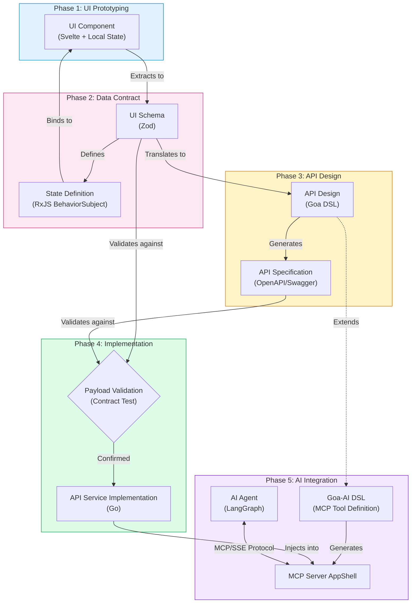

# Developer Guide: Virtual Module Core

This guide helps you use `virtual-module-core` to build generic modules, framework adapters, and follow the standard "UI-First" development workflow.

## Standard Development Workflow

The recommended workflow follows a **UI-First** approach, ensuring that the backend API exactly matches the needs of the frontend.



---

## Tutorial: Step-by-Step Implementation

This tutorial walks through building a "Portfolio" module using the standard UI-First workflow.

### Phase 1: Pure UI Prototyping (Local State)

**Goal**: Validate the UX with users using fully functional UI artifacts, BEFORE defining any schemas or backend.

1.  **Create the Widget**:
    - **Path**: `sveltekit/src/lib/widgets/PortfolioSummaryWidget.svelte`
    - **Technique**: Use standard Svelte 5 `$state` with **hardcoded local variables**.
    - **Components**: Use **ShadCN Svelte** from `$lib/components/ui`.

    ```svelte
    <script lang="ts">
      import * as Card from "../components/ui/card";

      // 1. Define Design-Time State (Local Variables)
      let ( totalValue = 125000.50, dayChange = 1250.00, changePercent = 1.0) = $props();

      // 2. Define Derived State
      //
      // Reactivity Source: When you write let { changePercent } = $props(), Svelte's compiler interprets changePercent as a reactive value (conceptually, it's like a 
      // signal getter).
      // Dependency Tracking: The $derived(...) rune automatically "watches" any reactive values used inside it. Since getChangeColor(changePercent) reads 
      // changePercent, a dependency is established.         
      let changeSign = $derived(getChangeSign(changePercent))

      function getChangeSign(changePercent: number): string {
        if (changePercent > 0.0) {
            return "+";
        } 
        return "";
      }          
    </script>

    <Card.Root class="h-full">
      <CardHeader><CardTitle>Portfolio Value</CardTitle></CardHeader>
      <Card.Header class="pb-2">
        <Card.Description>Total Balance</Card.Description>
        <div class="text-2xl font-bold">
          ${totalValue}
        </div>
      </Card.Header>
      <Card.Content>
        <div class="text-2xl font-bold">${dayChange}</div>
        <div class="text-sm text-muted-foreground">{changePercent}%</div>
      </Card.Content>
    </Card.Root>
    ```

2.  **Create Storybook Story**:
    - **Path**: `sveltekit/src/lib/widgets/PortfolioSummaryWidget.stories.ts`
    - **Goal**: Isolate the component for review without running the full app.
    - **Technique**: Use **Storybook** with **argTypes** to control the component's inputs. Try to declare parameters that are **derived** from the local variables.

    ```typescript
    import type { Meta, StoryObj } from "@storybook/svelte";
    import PortfolioSummaryWidget from "./PortfolioSummaryWidget.svelte";

    const meta = {
      title: "Widgets/PortfolioSummary",
      component: PortfolioSummaryWidget,
      tags: ["autodocs"],
      parameters: {
        layout: 'centered',
      },
      argTypes: {
        totalValue: {
            control: "number",
            description: "Total Value",
        },
        dayChange: {
            control: "number",
            description: "Day Change",
        },
        changePercent: {
            control: "number",
            description: "Change Percent",
        },
      },            
    } satisfies Meta<PortfolioSummaryWidget>;

    export default meta;
    type Story = StoryObj<typeof meta>;

    // Walk through with users to confirm the UI with different scenarios below
    export const Default: Story = {
      args: {
        totalValue: 125000.50,
        dayChange: 1250.00,
        changePercent: 1.0,
      },
    };

    export const NegativeBalance: Story = {
      args: {
        totalValue: 5000.50,
        dayChange: -1250.00,
        changePercent: -1.0,
      },
    };    
    ```

3.  **User Confirmation**:
    - Review this widget (via Storybook or Dev Server) with stakeholders.
    - Run `npx @moonrepo/cli run <project_name>-sveltekit:storybook` to view the widget in Storybook.
    - **Stop**: Do not proceed until the UI layout and interactivity are approved.

---

### Phase 2: Data Contract & Mock State (RxJS + Zod)

**Goal**: Formalize the approved UI data into a strict contract and mock service.

1.  **Extract to Zod Schema**:
    - **Path**: `ts/src/schema/portfolio.ts` (Shared Layer)
    - Take the local variables from Phase 1 and define them in Zod.

    ```typescript
    import { makeApi, Zodios, type ZodiosOptions } from "@zodios/core";
    import { z } from "zod";

    // ------------------------------------
    // Zod Schemas
    // ------------------------------------

    export const PortfolioSummarySchema = z.object({
      totalValue: z.number(), // Matches: let totalValue = $state(...)
      dayChange: z.number(), // Matches: let dayChange = $state(...)
      changePercent: z.number(), // Derived or added for completeness
    });

    export type PortfolioSummary = z.infer<typeof PortfolioSummarySchema>;

    export const schemas = {
      PortfolioSummary: PortfolioSummarySchema,
    };

    // ------------------------------------
    // Zodios API Definition
    //
    // Why Zodios?
    // 1. Strict Typing: Bridges the API and Zod schemas, enforcing type safety at the network boundary.
    // 2. Autocomplete: Generates a typed client with autocomplete for endpoints and parameters.
    // 3. RxJS Synergy: Speeds up development by ensuring API data *guaranteed* matches the BehaviorSubject's 
    //    expected Zod schema, eliminating manual validation code and type casting in your streams.
    // ------------------------------------

    const endpoints = makeApi([
      {
        method: "get",
        path: "/portfolio/summary",
        alias: "portfolio#summary",
        requestFormat: "json",
        parameters: [
          {
            name: "X-User-ID",
            type: "Header",
            schema: z.string(),
          },
        ],
        response: PortfolioSummarySchema,
      },
    ]);

    export const api = new Zodios(endpoints);

    export function createApiClient(baseUrl: string, options?: ZodiosOptions) {
      return new Zodios(baseUrl, endpoints, options);
    }
      
    ```

2.  **Create RxJS Service with Demo Data**:
    - **Path**: `ts/src/services/PortfolioService.ts`
    - Initialize the `BehaviorSubject` with **Demo Data** matching the schema. Do not call APIs yet.

    ```typescript
    import { BehaviorSubject } from 'rxjs';
    import { z } from 'zod';
    import { schemas, createApiClient, api } from '../schema/portfolio';

    export type PortfolioSummary = z.infer<typeof schemas.PortfolioSummarySchema>;
    export const PortfolioSummarySchema = schemas.PortfolioSummarySchema;
    type ApiClient = typeof api;

    export interface PortfolioConfig {
      apiBaseUrl: string;
      apiClient?: ApiClient;
    }

    export class PortfolioService {
      // Initialize with Demo Data for immediate UI feedback
      private _summary$ = new BehaviorSubject<PortfolioSummary | null>({
        totalValue: 125000.5,
        dayChange: 1250.0,
        percentChange: 1.0,
      });

      // RxJS BehaviorSubjects
      private _loading$ = new BehaviorSubject<boolean>(false);
      private _error$ = new BehaviorSubject<string | null>(null);      

      // RxJS Observables
      public summary$ = this._summary$.asObservable();
      public loading$ = this._loading$.asObservable();
      public error$ = this._error$.asObservable();

      // Declare apiClient local variable for RxJS
      private apiClient!: ApiClient;

      constructor(config: PortfolioConfig = { apiBaseUrl: "http://localhost:8000" }) {
        this.setConfig(config);
      }      

      public setConfig(config: PortfolioConfig) {
        if (config.apiClient) {
            this.apiClient = config.apiClient;
        } else {
            this.apiClient = createApiClient(config.apiBaseUrl);
        }
      }

      public async fetchSummary() {
        this._loading$.next(true);
        this._error$.next(null);
        try {
            const summary = await this.apiClient.get("/portfolio/summary", {
                headers: { 'X-User-ID': 'demo-user' }
            });
            this.summary = summary;
        } catch (e: any) {
            console.error('PortfolioService fetch error:', e);
            this._error$.next(e.message || "Failed to fetch portfolio summary");
        } finally {
            this._loading$.next(false);
        }
      }

      public set summary(summary: PortfolioSummary) {
        this._summary$.next(summary);
      }

      public get summary() {        
          return this._summary$.getValue();
      }

    }

    export const portfolioService = new PortfolioService();
    ```

---

### Phase 3: Connect UI to Shared State (Runes Integration)

**Goal**: Replace local hardcoded variables with the shared reactive state.

1.  **Create Rune Adapter**:
    - **Path**: `sveltekit/src/lib/runes/PortfolioState.svelte.ts`
    - Import the Zod type and RxJS service.
    
    ```typescript
    import { portfolioService, type PortfolioSummary, PortfolioSummarySchema } from '@modules/portfolio-ts';

    export class PortfolioState {
      // Svelte 5 Rune State
      summary = $state<PortfolioSummary | null>(portfolioService.currentState.summary);
      loading = $state<boolean>(portfolioService.currentState.loading);
      error = $state<string | null>(portfolioService.currentState.error);

      constructor() {
        // Subscribe to live updates
        portfolioService.summary$.subscribe((value) => {
            try {
                // Validate incoming data
                PortfolioSummarySchema.parse(value);
                this.summary = value;
            } catch (e) {
                console.error("Invalid portfolio summary update:", e);
                this.error = "Invalid data received";
            }
        });

        portfolioService.loading$.subscribe((value) => {
            this.loading = value;
        });

        portfolioService.error$.subscribe((value) => {
            this.error = value;
        });
      }
  
    }
    
    // Export as global singleton
    export const portfolioState = new PortfolioState();
    ```

2.  **Update Widget**:
    - **Path**: `sveltekit/src/lib/widgets/PortfolioSummaryWidget.svelte`
    - Replace local variables with the Rune state.

    ```svelte
    <script lang="ts">
      import { Card, CardContent, CardHeader, CardTitle } from "$lib/components/ui/card";

      // Commented out for now
      // // 1. Define Design-Time State (Local Variables)
      // let ( totalValue = 125000.50, dayChange = 1250.00, changePercent = 1.0) = $props();

      // New Added >>>

      // Import the Rune state
      import { portfolioSummaryState } from "../runes/PortfolioSummaryState.svelte";

      // Used for Storybook to override the global state.
      // We define this interface to allow parent components (like Storybook stories) to inject key data points directly,
      // bypassing the global stream if needed.
      interface Props {
          currency?: string;
          balance?: number;
          changePercent?: number;
      }
      // We rename the incoming props (e.g., currency -> currencyProp) to avoid naming collisions.
      // This allows us to declare derived values with the clean names (e.g., 'currency') below,
      // which serve as the single source of truth for the template by coalescing the prop override and the global state.
      let {
        currency: currencyProp,
        balance: balanceProp,
        changePercent: changePercentProp,
      }: Props = $props();

      // New Add <<<< END

      // 2. Define Derived State
      //
      // Reactivity Source: When you write let { changePercent } = $props(), Svelte's compiler interprets changePercent as a reactive value (conceptually, it's like a 
      // signal getter).
      // Dependency Tracking: The $derived(...) rune automatically "watches" any reactive values used inside it. Since getChangeColor(changePercent) reads 
      // changePercent, a dependency is established.         
      let changeSign = $derived(getChangeSign(changePercent))

      function getChangeSign(changePercent: number): string {
        if (changePercent > 0.0) {
            return "+";
        } 
        return "";
      }              
    </script>

    <Card>
      <CardHeader><CardTitle>Portfolio Value</CardTitle></CardHeader>
      <CardContent>
          <!-- Now driven by Shared State -->
          <div class="text-2xl font-bold">${portfolioSummaryState.summary.totalValue}</div>
          <div class="text-sm text-muted-foreground">+${portfolioSummaryState.summary.dayChange} ({portfolioSummaryState.summary.percentChange}%)</div>
      </CardContent>
    </Card>

    ```

---

### Phase 4: Backend Contract (Goa DSL)

**Goal**: Design an **Experience API** optimized for the UI's needs. The API structure should mirror the Runes/RxJS state requirements to minimize frontend data transformation and facilitate efficient navigation. This layer also acts as an orchestration point, capable of integrating with **Workflow Engines** (e.g., Temporal) or lower-level **Business APIs** to reuse back-office capabilities.

1.  **Map Zod to Goa**:
    - **Path**: `go/design/design.go`
    - Translate `ts/src/schema/portfolio.ts` -> Goa DSL.

    Recommendation: Use coding assistant to generate the Goa DSL. Example prompt: "can you read Zodios API from moduels/portfolio/ts/src/schema/portfolio.ts and update Goa Design DSL in modules/portfolio/go/design/portfolio.go"

    ```go
    import . "goa.design/goa/v3/dsl" // Imports JWTSecurity, Type, Service, etc.

    // Match Zod: { totalValue: number, dayChange: number ... }
    var PortfolioSummary = Type("PortfolioSummary", func() {
         Attribute("totalValue", Float64)  // Maps to z.number()
         Attribute("dayChange", Float64)   // Maps to z.number()
         Attribute("percentChange", Float64) // Maps to z.number()
         Required("totalValue", "dayChange") // required fields
    })

    // Define the Security Scheme
    var JWTAuth = JWTSecurity("jwt", func() {
        Description("JWT-based authentication using Bearer tokens")
        Scope("api:read", "Read access")
        Scope("api:write", "Write access")
        TokenPath("sub")  // or "user_id" if that's your claim name        
    })

    var _ = Service("portfolio", func() {
         // 1. Define Errors common to the service
         Error("unauthorized", String, "Missing or invalid token")
         Error("not_found", String, "Portfolio not found for user")

         // 2. Define Security (e.g., JWT)
         Security(JWTAuth, func() {
             Scope("api:read")   
         })

         Method("getPortfolioSummary", func() {
             Description("Get portfolio summary for the authenticated user")
             Payload(func() {
                 Attribute("userId", String)
                 // 1. Define attribute to hold the header value
                 Attribute("traceID", String, "Trace ID for distributed tracing")
                 Required("userId")
             })
             Security(JWTAuth, func() {
                 Scope("api:read")   
             })

             Result(PortfolioSummary)

             // 3. Map Errors to HTTP Status Codes
             HTTP(func() {
                GET("/portfolio/summary")

                // 2. Bind payload attribute "traceID" to HTTP Header "X-Trace-ID"
                Header("traceID:X-Trace-ID")
                Header("userId:X-User-ID")

                Response(StatusOK)
                Response("unauthorized", StatusUnauthorized)
                Response("not_found", StatusNotFound)
             })
         })
    })
    ```

2.  **Generate & Implement**:
    - Run `moon run portfolio-go:goa-gen`.
    - **Generated Files**:
      - `gen/portfolio/service.go`: Contains the `Service` interface you must implement.
      - `gen/http/`: Contains the HTTP server/client transport code.
      - `gen/portfolio/views/`: Contains view rendering logic.

3.  **Implement & Inject**:
    - **Implement**: Create `go/pkg/portfolio_service.go` implementing the interface in `go/gen/portfolio/service.go`.
    - **Inject**: In the Host App (`apps/ta-server/cmd/api-server.go`), wire it into the **Chi Router**:

    ```go
    // apps/ta-server/internal/di/services.go

    // Internal Modules
    portfolio "github.com/reidlai/ta-workspace/modules/portfolio/go/pkg"

    // Generated Interfaces
    portfolioGen "github.com/reidlai/ta-workspace/modules/portfolio/go/gen/portfolio"    

    // Services holds the initialized endpoints for the server.
    type Services struct {
	      PortfolioEndpoints *portfolioGen.Endpoints
    }

    // NewServices initializes the services and endpoints.
    func NewServices(logger *slog.Logger) *Services {
      var (
        portfolioSvc portfolioGen.Service
      )
      {
        portfolioSvc = portfolio.NewPortfolio(logger)
      }

      var (
        portfolioEndpoints *portfolioGen.Endpoints
      )
      {
        portfolioEndpoints = portfolioGen.NewEndpoints(portfolioSvc)
        portfolioEndpoints.Use(debug.LogPayloads())
      }

      return &Services{
        PortfolioEndpoints: portfolioEndpoints,
      }
    }
    ```

    ```go
    // apps/ta-server/internal/internal/server/run.go

    package server

    import (
      "context" 
      "fmt"
      "log/slog"
      "net"
      "net/url"
      "os"
      "os/signal"
      "sync"
      "syscall"

      "github.com/reidlai/ta-workspace/apps/go-server/internal/di"
    )

    // Run initializes and starts the API server.
    func Run(ctx context.Context, cfg Config) error {
      // Setup Slog
      var level slog.Level
      switch cfg.LogLevel {
      case "DEBUG":
        level = slog.LevelDebug
      case "WARN":
        level = slog.LevelWarn
      case "ERROR":
        level = slog.LevelError
      default:
        level = slog.LevelInfo
      }

      if cfg.Debug {
        level = slog.LevelDebug
      }

      var handler slog.Handler
      opts := &slog.HandlerOptions{
        Level: level,
        ReplaceAttr: func(groups []string, a slog.Attr) slog.Attr {
          // GCP Mapping
          if a.Key == slog.LevelKey {
            a.Key = "severity"
          }
          if a.Key == slog.MessageKey {
            a.Key = "message"
          }
          if a.Key == "trace_id" {
            a.Key = "logging.googleapis.com/trace"
          }
          if a.Key == "span_id" {
            a.Key = "logging.googleapis.com/spanId"
          }
          return a
        },
      }

      if cfg.LogFormat == "json" {
        handler = slog.NewJSONHandler(os.Stdout, opts)
      } else {
        handler = slog.NewTextHandler(os.Stdout, &slog.HandlerOptions{Level: level})
      }

      logger := slog.New(handler)
      slog.SetDefault(logger)

      logger.InfoContext(ctx, "Logger initialized",
        "level", level.String(),
        "format", cfg.LogFormat,
      )

      // Initialize services via DI container
      services := di.NewServices(logger)
      portfolioEndpoints := services.PortfolioEndpoints

      // Create channel for signal handling
      errc := make(chan error)

      // Setup interrupt handler
      go func() {
        c := make(chan os.Signal, 1)
        signal.Notify(c, syscall.SIGINT, syscall.SIGTERM)
        errc <- fmt.Errorf("%s", <-c)
      }()

      var wg sync.WaitGroup
      // Use the provided context, but also ensure cancellation capability
      ctx, cancel := context.WithCancel(ctx)
      defer cancel()

      // Build URL
      scheme := "http"
      if cfg.Secure {
        scheme = "https"
      }
      addr := fmt.Sprintf("%s://%s", scheme, net.JoinHostPort(cfg.Host, fmt.Sprintf("%d", cfg.Port)))
      u, err := url.Parse(addr)
      if err != nil {
        return fmt.Errorf("invalid URL %s: %w", addr, err)
      }

      // Start HTTP server
      HandleHTTPServer(ctx, u, portfolioEndpoints, &wg, errc, logger, cfg.Debug)

      // Wait for signal
      logger.InfoContext(ctx, "exiting", "signal", <-errc)

      // Send cancellation signal
      cancel()

      wg.Wait()
      logger.InfoContext(ctx, "exited")
      return nil
    }
    ```

    ```go
    package server

    import (
      "context"
      "log/slog"
      "net/http"
      "net/url"
      "sync"
      "time"

      portfoliosvr "github.com/reidlai/ta-workspace/modules/portfolio/go/gen/goa/http/portfolio/server"
      portfolio "github.com/reidlai/ta-workspace/modules/portfolio/go/gen/goa/portfolio"

      chimiddleware "github.com/go-chi/chi/v5/middleware"
      "go.opentelemetry.io/otel/trace"
      "goa.design/clue/debug"
      goahttp "goa.design/goa/v3/http"
    )

    // HandleHTTPServer starts configures and starts a HTTP server on the given
    // URL. It shuts down the server if any error is received in the error channel.
    func HandleHTTPServer(ctx context.Context, u *url.URL, portfolioEndpoints *portfolio.Endpoints, wg *sync.WaitGroup, errc chan error, logger *slog.Logger, dbg bool) {

      // Provide the transport specific request decoder and response encoder.
      // The goa http package has built-in support for JSON, XML and gob.
      // Other encodings can be used by providing the corresponding functions,
      // see goa.design/implement/encoding.
      var (
        dec = goahttp.RequestDecoder
        enc = goahttp.ResponseEncoder
      )

      // Build the Goa muxer (uses Chi internally)
      var mux goahttp.Muxer
      {
        mux = goahttp.NewMuxer()
        if dbg {
          // Mount pprof handlers for memory profiling under /debug/pprof.
          debug.MountPprofHandlers(debug.Adapt(mux))
          // Mount /debug endpoint to enable or disable debug logs at runtime.
          debug.MountDebugLogEnabler(debug.Adapt(mux))
        }
      }

      // Wrap the endpoints with the transport specific layers. The generated
      // server packages contains code generated from the design which maps
      // the service input and output data structures to HTTP requests and
      // responses.
      var (
        portfolioServer *portfoliosvr.Server
      )
      {
        eh := errorHandler(ctx, logger)
        portfolioServer = portfoliosvr.New(portfolioEndpoints, mux, dec, enc, eh, nil)
      }

      // Configure the mux.
      portfoliosvr.Mount(mux, portfolioServer)

      var handler http.Handler = mux
      // Apply Chi middleware for performance and resilience
      handler = chimiddleware.RequestID(handler)
      handler = chimiddleware.RealIP(handler)
      handler = chimiddleware.Recoverer(handler)

      // Inject Slog Logger with Trace Context
      handler = SlogMiddleware(logger)(handler)

      if dbg {
        // Log query and response bodies if debug logs are enabled.
        handler = debug.HTTP()(handler)
      }

      // Start HTTP server using default configuration, change the code to
      // configure the server as required by your service.
      srv := &http.Server{Addr: u.Host, Handler: handler, ReadHeaderTimeout: time.Second * 60}
      for _, m := range portfolioServer.Mounts {
        logger.InfoContext(ctx, "HTTP handler mounted", "method", m.Method, "verb", m.Verb, "pattern", m.Pattern)
      }

      (*wg).Add(1)
      go func() {
        defer (*wg).Done()

        // Start HTTP server in a separate goroutine.
        go func() {
          logger.InfoContext(ctx, "HTTP server listening", "host", u.Host)
          errc <- srv.ListenAndServe()
        }()

        <-ctx.Done()
        logger.InfoContext(ctx, "shutting down HTTP server", "host", u.Host)

        // Shutdown gracefully with a 30s timeout.
        ctx, cancel := context.WithTimeout(context.Background(), 30*time.Second)
        defer cancel()

        err := srv.Shutdown(ctx)
        if err != nil {
          logger.ErrorContext(ctx, "failed to shutdown", "error", err)
        }
      }()
    }

    // errorHandler returns a function that writes and logs the given error.
    // The function also writes and logs the error unique ID so that it's possible
    // to correlate.
    func errorHandler(logCtx context.Context, logger *slog.Logger) func(context.Context, http.ResponseWriter, error) {
      return func(ctx context.Context, w http.ResponseWriter, err error) {
        logger.ErrorContext(ctx, "HTTP Error", "error", err)
      }
    }

    // SlogMiddleware extracts OTel trace IDs and injects a logger into the context.
    func SlogMiddleware(logger *slog.Logger) func(http.Handler) http.Handler {
      return func(next http.Handler) http.Handler {
        return http.HandlerFunc(func(w http.ResponseWriter, r *http.Request) {
          ctx := r.Context()
          span := trace.SpanFromContext(ctx)

          // Inject trace_id and span_id if available (and valid) across all environments
          reqLogger := logger
          if span.SpanContext().IsValid() {
            // We attach the trace info to the logger's attributes.
            // For the JSON/GCP handler (Phase 3), the ReplaceAttr function handles mapping these keys
            // to logging.googleapis.com/trace, etc.
            // For Text/Dev handler (Phase 4), these just appear as normal attributes.
            traceID := span.SpanContext().TraceID().String()
            spanID := span.SpanContext().SpanID().String()

            reqLogger = logger.With(
              slog.String("trace_id", traceID),
              slog.String("span_id", spanID),
            )
          }

          // Log request start
          reqLogger.InfoContext(ctx, "request started",
            "method", r.Method,
            "path", r.URL.Path,
            "remote_addr", r.RemoteAddr,
          )

          // Update context with logger
          // NOTE: We rely on standard context behavior. Services should use slog.Default() or
          // take explicit logger. If services need to retrieve this logger from context,
          // we would need a custom context key. For now, we assume simple usage or
          // explicit passing. Services are refactored in Phase 5 to take *slog.Logger.
          // Ideally, we'd have a ContextWithLogger helper if deep context extraction is needed.

          next.ServeHTTP(w, r)
        })
      }
    }
    ```


---

### Phase 5: AI Integration (Goa-AI + MCP)

**Goal**: Expose the service logic to AI Agents via Model Context Protocol (MCP) and inject into MCP Server AppShell.

1.  **Define MCP Tool in Goa DSL**:
    - **Path**: `go/design/design.go` (Update)
    - Use `goa.design/ai` DSL to expose methods as AI tools.

    ```go
    import (
        . "goa.design/goa/v3/dsl"
        . "goa.design/ai/dsl" // Integration
    )

    var _ = Service("portfolio", func() {
        // ... existing definition ...

        Method("getPortfolioSummary", func() {
            // ... HTTP definitions ...

            // Define AI Tool Exposure
            AI(func() {
                 Description("Get portfolio summary for the current user")
                 Tool("get_portfolio_summary")
            })
        })
    })
    ```

2.  **Generate MCP Server Stubs**:
    - Run `moon run portfolio-go:goa-gen`.
    - This generates the tool definitions and interface code.

3.  **Inject into MCP Server AppShell**:
    - The MCP Server AppShell (`apps/mcp-server`) acts as the host.
    - Inject your module's service implementation into the MCP host at runtime (similar to HTTP server injection).

    ```go
    // apps/mcp-server/main.go
    // ...
    portfolioSvc := portfolio.NewPortfolioService(logger, db)
    mcpServer.RegisterTool("get_portfolio_summary", portfolioSvc.GetPortfolioSummary)
    ```

4.  **Connect AI Agent**:
    - AI Agents (e.g. LangGraph) connect to the MCP Server via SSE or Stdio.
    - The Agent automatically discovers `get_portfolio_summary` and calls it when needed using the strictly typed schema.
