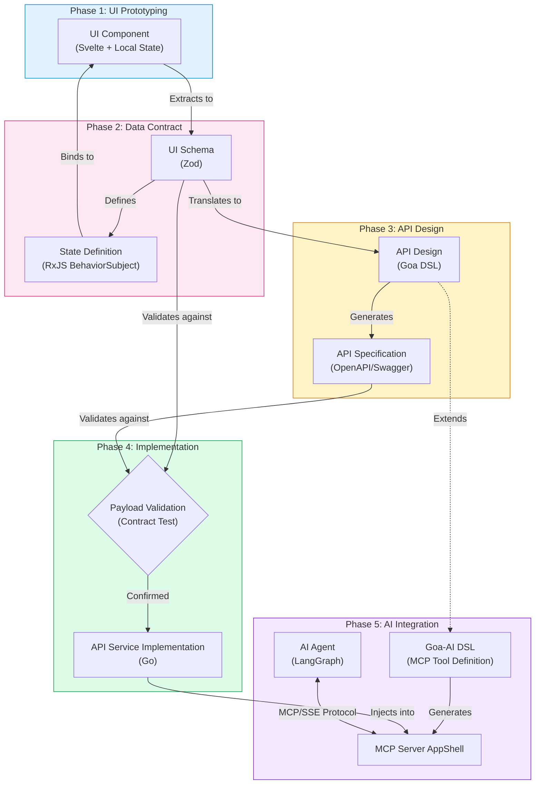

# Developer Guide: Virtual Module Core

This guide helps you use `virtual-module-core` to build generic modules, framework adapters, and follow the standard "UI-First" development workflow.

## Standard Development Workflow

The recommended workflow follows a **UI-First** approach, ensuring that the backend API exactly matches the needs of the frontend.



---

## Tutorial: Step-by-Step Implementation

This tutorial walks through building a "Portfolio" module using the standard UI-First workflow.

### Phase 1: Pure UI Prototyping (Local State)

**Goal**: Validate the UX with users using fully functional UI artifacts, BEFORE defining any schemas or backend.

1.  **Create the Widget**:
    - **Path**: `sveltekit/src/lib/widgets/PortfolioSummaryWidget.svelte`
    - **Technique**: Use standard Svelte 5 `$state` with **hardcoded local variables**.
    - **Components**: Use **ShadCN Svelte** from `$lib/components/ui`.

    ```svelte
    <script lang="ts">
      import { Card, CardContent, CardHeader, CardTitle } from "$lib/components/ui/card";

      // 1. Define Design-Time State (Local Variables)
      let totalValue = $state(125000.50);
      let dayChange = $state(1250.00);
      let percentChange = $state(1.0);
    </script>

    <Card>
      <CardHeader><CardTitle>Portfolio Value</CardTitle></CardHeader>
      <CardContent>
        <div class="text-2xl font-bold">${totalValue}</div>
        <div class="text-sm text-muted-foreground">+${dayChange} ({percentChange}%)</div>
      </CardContent>
    </Card>
    ```

2.  **Create Storybook Story**:
    - **Path**: `sveltekit/src/lib/widgets/PortfolioSummaryWidget.stories.ts`
    - **Goal**: Isolate the component for review without running the full app.

    ```typescript
    import type { Meta, StoryObj } from "@storybook/svelte";
    import PortfolioSummaryWidget from "./PortfolioSummaryWidget.svelte";

    const meta = {
      title: "Widgets/PortfolioSummary",
      component: PortfolioSummaryWidget,
      tags: ["autodocs"],
    } satisfies Meta<PortfolioSummaryWidget>;

    export default meta;
    type Story = StoryObj<typeof meta>;

    export const Default: Story = {};
    ```

3.  **User Confirmation**:
    - Review this widget (via Storybook or Dev Server) with stakeholders.
    - **Stop**: Do not proceed until the UI layout and interactivity are approved.

---

### Phase 2: Data Contract & Mock State (RxJS + Zod)

**Goal**: Formalize the approved UI data into a strict contract and mock service.

1.  **Extract to Zod Schema**:
    - **Path**: `ts/src/schema/portfolio.ts` (Shared Layer)
    - Take the local variables from Phase 1 and define them in Zod.

    ```typescript
    import { z } from "zod";

    export const PortfolioSummarySchema = z.object({
      totalValue: z.number(), // Matches: let totalValue = $state(...)
      dayChange: z.number(), // Matches: let dayChange = $state(...)
      percentChange: z.number(), // Derived or added for completeness
    });

    export type PortfolioSummary = z.infer<typeof PortfolioSummarySchema>;
    ```

2.  **Create RxJS Service with Demo Data**:
    - **Path**: `ts/src/services/PortfolioService.ts`
    - Initialize the `BehaviorSubject` with **Demo Data** matching the schema. Do not call APIs yet.

    ```typescript
    import { BehaviorSubject } from "rxjs";
    import {
      PortfolioSummarySchema,
      type PortfolioSummary,
    } from "../schema/portfolio";

    export class PortfolioService {
      // Initialize with Demo Data for immediate UI feedback
      private _summary$ = new BehaviorSubject<PortfolioSummary | null>({
        totalValue: 125000.5,
        dayChange: 1250.0,
        percentChange: 1.0,
      });

      public readonly summary$ = this._summary$.asObservable();

      // Later: this will be replaced by API calls in Phase 4
      public updateData(newData: PortfolioSummary) {
        const valid = PortfolioSummarySchema.parse(newData);
        this._summary$.next(valid);
      }
    }

    export const portfolioService = new PortfolioService();
    ```

---

### Phase 3: Connect UI to Shared State (Runes Integration)

**Goal**: Replace local hardcoded variables with the shared reactive state.

1.  **Create Rune Adapter**:
    - **Path**: `sveltekit/src/lib/runes/PortfolioState.svelte.ts`
    - Import the Zod type and RxJS service.

    ```typescript
    import { portfolioService } from "@modules/portfolio-ts/services/PortfolioService";
    import type { PortfolioSummary } from "@modules/portfolio-ts/schema/portfolio";

    export class PortfolioState {
      // Svelte 5 Rune State
      summary = $state<PortfolioSummary | null>(null);

      constructor() {
        // Bridge RxJS Observable -> Svelte Rune
        portfolioService.summary$.subscribe((val) => {
          this.summary = val;
        });
      }
    }
    // Export as global singleton
    export const portfolioState = new PortfolioState();
    ```

2.  **Update Widget**:
    - **Path**: `sveltekit/src/lib/widgets/PortfolioSummaryWidget.svelte`
    - Replace local variables with the Rune state.

    ```svelte
    <script lang="ts">
      import { portfolioState } from "$lib/runes/PortfolioState.svelte";
      // Removed local $state variables
    </script>

    {#if portfolioState.summary}
      <Card>
        <CardHeader><CardTitle>Portfolio Value</CardTitle></CardHeader>
        <CardContent>
           <!-- Now driven by Shared State -->
           <div class="text-2xl font-bold">${portfolioState.summary.totalValue}</div>
           <div class="text-sm text-muted-foreground">+${portfolioState.summary.dayChange} ({portfolioState.summary.percentChange}%)</div>
        </CardContent>
      </Card>
    {/if}
    ```

---

### Phase 4: Backend Contract (Goa DSL)

**Goal**: Design an **Experience API** optimized for the UI's needs. The API structure should mirror the Runes/RxJS state requirements to minimize frontend data transformation and facilitate efficient navigation. This layer also acts as an orchestration point, capable of integrating with **Workflow Engines** (e.g., Temporal) or lower-level **Business APIs** to reuse back-office capabilities.

1.  **Map Zod to Goa**:
    - **Path**: `go/design/design.go`
    - Translate `ts/src/schema/portfolio.ts` -> Goa DSL.

    ```go
    import . "goa.design/goa/v3/dsl" // Imports JWTSecurity, Type, Service, etc.

    // Match Zod: { totalValue: number, dayChange: number ... }
    var PortfolioSummary = Type("PortfolioSummary", func() {
         Attribute("totalValue", Float64)  // Maps to z.number()
         Attribute("dayChange", Float64)   // Maps to z.number()
         Attribute("percentChange", Float64) // Maps to z.number()
         Required("totalValue", "dayChange") // required fields
    })

    // Define the Security Scheme
    var JWTAuth = JWTSecurity("jwt", func() {
        Scope("api:read", "Read access")
        Scope("api:write", "Write access")
    })

    var _ = Service("portfolio", func() {
         // 1. Define Errors common to the service
         Error("unauthorized", String, "Missing or invalid token")
         Error("not_found", String, "Portfolio not found for user")

         // 2. Define Security (e.g., JWT)
         Security(JWTAuth)

         Method("getSummary", func() {
             Payload(func() {
                 Attribute("userId", String)
                 // 1. Define attribute to hold the header value
                 Attribute("traceID", String, "Trace ID for distributed tracing")
                 Required("userId")
             })

             Result(PortfolioSummary)

             // 3. Map Errors to HTTP Status Codes
             HTTP(func() {
                GET("/summary/{userId}")

                // 2. Bind payload attribute "traceID" to HTTP Header "X-Trace-ID"
                Header("traceID:X-Trace-ID")

                Response(StatusOK)
                Response("unauthorized", StatusUnauthorized)
                Response("not_found", StatusNotFound)
             })
         })
    })
    ```

2.  **Generate & Implement**:
    - Run `moon run portfolio-go:goa-gen`.
    - **Generated Files**:
      - `gen/portfolio/service.go`: Contains the `Service` interface you must implement.
      - `gen/http/`: Contains the HTTP server/client transport code.
      - `gen/portfolio/views/`: Contains view rendering logic.

3.  **Implement & Inject**:
    - **Implement**: Create `portfolio.go` at the module root implementing the interface in `gen/portfolio/service.go`.
    - **Inject**: In the Host App (`apps/ta-server/cmd/api-server.go`), wire it into the **Chi Router**:

    ```go
    // apps/ta-server/cmd/api-server.go

    // 1. Instantiate the Service
    portfolioSvc := portfolio.NewPortfolioService(logger, db) // Your Constructor

    // 2. Instantiate Goa Endpoint & Transport
    portfolioEndpoints := portfolio_gen.NewEndpoints(portfolioSvc)
    portfolioServer := portfolio_http.NewServer(
        portfolioEndpoints,
        mux, // mux is the Chi Router
        decoder,
        encoder,
        nil, nil)

    // 3. Mount Routes
    portfolio_http.Mount(mux, portfolioServer)
    ```

---

### Phase 5: AI Integration (Goa-AI + MCP)

**Goal**: Expose the service logic to AI Agents via Model Context Protocol (MCP) and inject into MCP Server AppShell.

1.  **Define MCP Tool in Goa DSL**:
    - **Path**: `go/design/design.go` (Update)
    - Use `goa.design/ai` DSL to expose methods as AI tools.

    ```go
    import (
        . "goa.design/goa/v3/dsl"
        . "goa.design/ai/dsl" // Integration
    )

    var _ = Service("portfolio", func() {
        // ... existing definition ...

        Method("getSummary", func() {
            // ... HTTP definitions ...

            // Define AI Tool Exposure
            AI(func() {
                 Description("Get portfolio summary for the current user")
                 Tool("get_portfolio_summary")
            })
        })
    })
    ```

2.  **Generate MCP Server Stubs**:
    - Run `moon run portfolio-go:goa-gen`.
    - This generates the tool definitions and interface code.

3.  **Inject into MCP Server AppShell**:
    - The MCP Server AppShell (`apps/mcp-server`) acts as the host.
    - Inject your module's service implementation into the MCP host at runtime (similar to HTTP server injection).

    ```go
    // apps/mcp-server/main.go
    // ...
    portfolioSvc := portfolio.NewPortfolioService(logger, db)
    mcpServer.RegisterTool("get_portfolio_summary", portfolioSvc.GetSummary)
    ```

4.  **Connect AI Agent**:
    - AI Agents (e.g. LangGraph) connect to the MCP Server via SSE or Stdio.
    - The Agent automatically discovers `get_portfolio_summary` and calls it when needed using the strictly typed schema.
