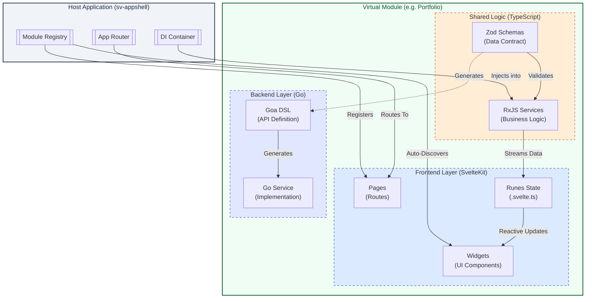

# Portfolio Virtual Module Architecture

**Primary Reference**: [`ta-workspace/docs/DEVELOPER-GUIDE.md`](https://github.com/reidlai/ta-workspace/blob/main/docs/DEVELOPER-GUIDE.md)

**AppShell Details**: [`ta-workspace/docs/APPSHELL-ARCHITECTURE.md`](https://github.com/reidlai/ta-workspace/blob/main/docs/APPSHELL-ARCHITECTURE.md)

## Overview

The Portfolio Module is a **polyglot Virtual Module** designed to be embedded into the [ta-workspace](https://github.com/reidlai/ta-workspace) monorepo. It follows the modular architecture pattern where components are developed independently as a Git submodule but deployed as part of the host application.

### Module Structure

Following the workspace standard defined in [`DEVELOPER-GUIDE.md`](https://github.com/reidlai/ta-workspace/blob/main/docs/DEVELOPER-GUIDE.md#architecture-summary):



```
portfolio/
├── go/                              # Backend Layer (Goa)
│   ├── design/                      # Goa DSL (mirrors Zod schemas)
│   ├── gen/                         # Generated Goa code
│   ├── pkg/                         # Service implementations
│   └── moon.yml                     # Go project tasks
├── ts/                              # Shared Logic Layer
│   ├── src/
│   │   ├── schema/                  # ✅ Zod schemas (single source of truth)
│   │   ├── services/                # ✅ RxJS services (validate against schemas)
│   │   └── index.ts                 # ✅ Export schemas + services
│   ├── package.json
│   └── moon.yml                     # TypeScript project tasks
├── sveltekit/                       # UI Layer (SvelteKit)
│   ├── src/
│   │   └── lib/
│   │       ├── components/ui/       # ShadCN Svelte components
│   │       ├── widgets/             # Reusable UI widgets
│   │       ├── runes/               # Svelte 5 runes (import from @modules/portfolio-ts)
│   │       └── routes/              # SvelteKit routes
│   ├── package.json                 # Depends on: "@modules/portfolio-ts": "workspace:*"
│   └── moon.yml                     # Svelte project tasks
├── docs/
│   └── VIRTUAL-MODULE-ARCHITECTURE.md  # This file
├── threat_modelling/                # Security models (PyTM)
└── moon.yml                         # Module root aggregated tasks

Dependency Flow: sveltekit → ts ← go (one-way, no circular dependencies)
```

**Key Principles**:

- **Schemas in `ts/src/schema/`**: Avoids circular dependencies (see [DEVELOPER-GUIDE.md](https://github.com/reidlai/ta-workspace/blob/main/docs/DEVELOPER-GUIDE.md#data-contract-zod-schemas))
- **RxJS Services in `ts/src/services/`**: Validate all data against Zod schemas
- **Svelte Components**: Import from `@modules/portfolio-ts` via workspace alias

## Integration Model

### Git Submodule Integration

This module is developed as a **separate Git repository** and integrated via Git submodules. See [`DEVELOPER-GUIDE.md - Git Submodule Workflow`](https://github.com/reidlai/ta-workspace/blob/main/docs/DEVELOPER-GUIDE.md#git-submodule-workflow) for details.

**Integration Steps**:

1. **Add as Submodule** (from workspace root):

   ```bash
   git submodule add git@github.com:yourorg/portfolio-virtmod.git modules/portfolio
   git submodule update --init --recursive
   ```

2. **Configure Workspace** (see [DEVELOPER-GUIDE.md - Workspace Configuration](https://github.com/reidlai/ta-workspace/blob/main/docs/DEVELOPER-GUIDE.md#workspace-level-configuration-files)):
   - Update `.moon/workspace.yml` - Add project paths
   - Update `pnpm-workspace.yaml` - Add package paths
   - Update `go.work` - Add Go module path
   - Update `apps/sv-appshell/svelte.config.js` - Add `@modules/portfolio-ts` alias
   - Update `apps/sv-appshell/vite.config.ts` - Add `@modules/portfolio-ts` alias

3. **Install Dependencies**:
   ```bash
   pnpm install
   moon sync
   ```

### NOT a Standalone Service

This module is **NOT** designed to run independently. It has:

- ❌ No main entry point
- ❌ No independent HTTP server
- ❌ No database ownership
- ❌ No authentication system

Instead, it provides **embeddable components** that are:

- ✅ Compiled into the host app's binary (Go services)
- ✅ Bundled into the host app's frontend (Svelte widgets)
- ✅ Registered at runtime via the host's service registry

## Component Boundaries

This architecture follows the **UI-First** design flow: `UI (Svelte)` → `Data Contract (Schema)` → `State (RxJS)` → `API (Go)`.

### 1. Frontend (Svelte)

**Role**: User Interaction & Presentation
**Design Artifacts**: Storybook Stories, Figma Designs

The UI drives the requirements. We use **Svelte 5 Runes** to manage local reactivity, bridging from the shared RxJS services.

**Pattern**: Widget Registry + Rune Adapter

**1. Create the Rune Adapter** (`sveltekit/src/lib/runes/PortfolioState.svelte.ts`):

```typescript
import { portfolioService } from "@modules/portfolio-ts/services/PortfolioService";
import type { PortfolioSummary } from "@modules/portfolio-ts/schema/portfolioSummary";

export class PortfolioState {
  // Svelte 5 Reactive State
  summary = $state<PortfolioSummary | null>(null);

  constructor() {
    // Bridge RxJS Stream -> Svelte Rune
    portfolioService.summary$.subscribe((data) => {
      this.summary = data;
    });
  }
}

// Export singleton or create new instances as needed
export const portfolioState = new PortfolioState();
```

**2. Consume in Widget** (`sveltekit/src/lib/widgets/PortfolioSummaryWidget.svelte`):

```svelte
<script lang="ts">
  import { portfolioState } from '$lib/runes/PortfolioState.svelte';

  // Reactivity is automatic with Runes
  // No $ prefix needed for class properties, just for the import if it was a store
</script>

{#if portfolioState.summary}
  <div class="summary">
    <h2>Total Value: {portfolioState.summary.totalValue}</h2>
  </div>
{/if}
```

**Boundaries**:

- **Routing**: No internal routing logic; components render into host slots.
- **State**: Strictly controlled via Runes (`.svelte.ts`) in `lib/runes/`.
- **Inputs**: strictly typed props or service subscriptions.

### 2. Shared Schemas & Services (TypeScript)

**Role**: Data Contract & State Management
**Design Artifacts**: Zod Schemas

Once the UI requirements are clear, they are solidified into **Zod Schemas**. These schemas serve as the single source of truth for both the frontend state and the backend API.

**Pattern**: Zod Schema + RxJS Services

```typescript
// 1. Define the Contract (Zod)
// modules/portfolio/ts/src/schema/portfolioSummary.ts
export const PortfolioSummarySchema = z.object({
  totalValue: z.number(),
  // ...
});

// 2. Implement State (RxJS)
// modules/portfolio/ts/src/services/PortfolioService.ts
export class PortfolioService {
  // Data flowing to UI is validated against the schema
  public setSummary(data: unknown) {
    const valid = PortfolioSummarySchema.parse(data);
    this._summary$.next(valid);
  }
}
```

**Boundaries**:

- **Schema Authority**: `ts/src/schema/` is the master definition.
- **Validation**: Services act as gatekeepers, ensuring only valid data reaches the UI.
- **Decoupling**: Decouples UI from the specific backend transport (HTTP, WebSocket).

### 3. Backend (Go)

**Role**: Business Logic & Persistence
**Design Artifacts**: Goa DSL (mapped from Zod)

The backend implements the API contract defined by the Zod schemas.

**Critical Step: Zod to Goa Mapping**
As per `DEVELOPER-GUIDE.md`, we use AI assistance to translate Zod schemas into Goa DSL to ensure exact type matching.

**Pattern**: Service Provider with Dependency Injection

**Module Design** (`modules/portfolio/go/design/design.go`):

```go
// Goa DSL matches Zod Schema
var PortfolioSummary = Type("PortfolioSummary", func() {
    Attribute("totalValue", Float64, "Total portfolio value")
    // ... matches PortfolioSummarySchema
    Required("totalValue")
})

var _ = Service("portfolio", func() {
    Method("getSummary", func() {
        Result(PortfolioSummary) // JSON response structure
        HTTP(func() {
            GET("/summary")
        })
    })
})
```

**Module Implementation** (`modules/portfolio/go/pkg/service.go`):

```go
// Module implements the contract
func NewPortfolioService(logger *slog.Logger, db *sql.DB) portfolio.Service {
    return &portfolioService{ logger: logger, db: db }
}
```

### 4. Contract Verification (Loop Closure)

**Goal**: Ensure Frontend (Zod) and Backend (OpenAPI) stay in sync.

After generating the Go code, Goa produces an OpenAPI specification at `go/gen/http/openapi3.json`. We must validate our Zod schemas against this spec.

**Validation Step**:

1.  **Generate OpenAPI Spec**: `moon run portfolio-go:goa-gen`
2.  **Validate Zod vs OpenAPI**:
    Run a contract test in `ts/src/schema/portfolioSummary.test.ts` using a tool like `openapi-zod-validator` (or similar utility).

    ```typescript
    // ts/src/schema/portfolioSummary.test.ts
    import { PortfolioSummarySchema } from "./portfolioSummary";
    import openApiSpec from "../../../go/gen/http/openapi3.json";

    test("Zod schema matches OpenAPI spec", () => {
      // Pseudo-code: verify that the Zod shape matches the OpenAPI definition
      expect(PortfolioSummarySchema).toMatchOpenApi(
        openApiSpec,
        "PortfolioSummary",
      );
    });
    ```

**Boundaries**:

- **Contract Fulfillment**: Must implement the interface generated by Goa (which matches the Zod schema).
- **Statelessness**: Logic should be stateless; persistence is handled via injected DB connections.
- **Verification**: CI pipeline fails if Zod schema and OpenAPI spec diverge.
- **Isolation**: No direct dependency on Svelte or TypeScript code; purely satisfies the API contract.

## Dependency Management

### Go Dependencies

```go
// go.mod
module github.com/reidlai/ta-workspace/modules/portfolio/go

require (
    goa.design/goa/v3 v3.23.4
    // Host app provides: logger, DB, config
)
```

**Pattern**: Dependency Injection

- Module declares interfaces
- Host app provides implementations

### Node Dependencies

```json
// sveltekit/package.json
{
  "dependencies": {
    "@core/types": "workspace:*" // From host
  }
}
```

**Pattern**: Workspace Protocol

- Shared types via monorepo workspace
- No version conflicts

## Security Model

### Threat Surface

The module inherits the host app's security posture:

- **Authentication**: Host's session middleware
- **Authorization**: Host's RBAC policies
- **Data Access**: Host's DB connection pool
- **Network**: Host's TLS termination

### Threat Modeling

See `threat_modelling/tm.py` for PyTM model:

- Assumes trusted host environment
- No direct external exposure
- Data flows through host's API gateway

---

## UI-First Development Workflow

**Reference**: [`ta-workspace/docs/DEVELOPER-GUIDE.md`](https://github.com/reidlai/ta-workspace/blob/main/docs/DEVELOPER-GUIDE.md#standard-module-workflow)

This module follows a strictly phased **UI-First** design philosophy. Do NOT start backend coding until Phase 3.

### Phase 1: Pure UI Prototyping (Local State)

**Goal**: Validate the UX with users using fully functional UI artifacts, BEFORE defining any schemas or backend.

1.  **Create the Widget**:
    - **Path**: `sveltekit/src/lib/widgets/PortfolioSummaryWidget.svelte`
    - **Technique**: Use standard Svelte 5 `$state` with **hardcoded local variables**.
    - **Components**: Use **ShadCN Svelte** from `$lib/components/ui`.

    ```svelte
    <script lang="ts">
      import { Card, CardContent, CardHeader, CardTitle } from "$lib/components/ui/card";

      // 1. Define Design-Time State (Local Variables)
      let totalValue = $state(125000.50);
      let dayChange = $state(1250.00);
    </script>

    <Card>
      <CardHeader><CardTitle>Portfolio Value</CardTitle></CardHeader>
      <CardContent>
        <div class="text-2xl font-bold">${totalValue}</div>
        <div class="text-sm text-muted-foreground">+${dayChange} (1.0%)</div>
      </CardContent>
    </Card>
    ```

2.  **User Confirmation**:
    - Review this widget (via Storybook or Dev Server) with stakeholders.
    - **Stop**: Do not proceed until the UI layout and interactivity are approved.

---

### Phase 2: Data Contract & Mock State (RxJS + Zod)

**Goal**: Formalize the approved UI data into a strict contract and mock service.

1.  **Extract to Zod Schema**:
    - **Path**: `ts/src/schema/portfolio.ts` (Shared Layer)
    - Take the local variables from Phase 1 and define them in Zod.

    ```typescript
    import { z } from "zod";

    export const PortfolioSummarySchema = z.object({
      totalValue: z.number(),
      dayChange: z.number(),
      percentChange: z.number(),
    });

    export type PortfolioSummary = z.infer<typeof PortfolioSummarySchema>;
    ```

2.  **Create RxJS Service with Mocks**:
    - **Path**: `ts/src/services/PortfolioService.ts`
    - Initialize the `BehaviorSubject` with **mock data** matching the schema. Do not call APIs yet.

    ```typescript
    import { BehaviorSubject } from "rxjs";
    import {
      PortfolioSummarySchema,
      type PortfolioSummary,
    } from "../schema/portfolio";

    export class PortfolioService {
      // Initialize with MOCK data for immediate UI feedback
      private _summary$ = new BehaviorSubject<PortfolioSummary | null>({
        totalValue: 125000.5,
        dayChange: 1250.0,
        percentChange: 1.0,
      });

      public readonly summary$ = this._summary$.asObservable();

      // Later: this will be replaced by API calls in Phase 4
      public updateMockData(newData: PortfolioSummary) {
        const valid = PortfolioSummarySchema.parse(newData);
        this._summary$.next(valid);
      }
    }

    export const portfolioService = new PortfolioService();
    ```

---

### Phase 3: Connect UI to Shared State (Runes Integration)

**Goal**: Replace local hardcoded variables with the shared reactive state.

1.  **Create Rune Adapter**:
    - **Path**: `sveltekit/src/lib/runes/PortfolioState.svelte.ts`
    - Import the Zod type and RxJS service.

    ```typescript
    import { portfolioService } from "@modules/portfolio-ts/services/PortfolioService";
    import type { PortfolioSummary } from "@modules/portfolio-ts/schema/portfolio";

    export class PortfolioState {
      summary = $state<PortfolioSummary | null>(null);

      constructor() {
        // Sync RxJS -> Svelte State
        portfolioService.summary$.subscribe((val) => {
          this.summary = val;
        });
      }
    }
    export const portfolioState = new PortfolioState();
    ```

2.  **Update Widget**:
    - **Path**: `sveltekit/src/lib/widgets/PortfolioSummaryWidget.svelte`
    - Replace local variables with the Rune state.

    ```svelte
    <script lang="ts">
      import { portfolioState } from "$lib/runes/PortfolioState.svelte";
      // Removed local $state variables
    </script>

    {#if portfolioState.summary}
      <Card>
        <CardContent>
           <!-- Now driven by Shared State -->
           <div class="text-2xl">${portfolioState.summary.totalValue}</div>
        </CardContent>
      </Card>
    {/if}
    ```

---

### Phase 4: Backend Contract (Goa DSL)

**Goal**: Ensure the backend implements the exact structure expected by the UI.

1.  **Map Zod to Goa**:
    - **Path**: `go/design/design.go`
    - Translate `ts/src/schema/portfolio.ts` -> Goa DSL.

    ```go
    // Match Zod: { totalValue: number, dayChange: number ... }
    var PortfolioSummary = Type("PortfolioSummary", func() {
         Attribute("totalValue", Float64)  // Maps to z.number()
         Attribute("dayChange", Float64)   // Maps to z.number()
         Attribute("percentChange", Float64)
         Required("totalValue", "dayChange")
    })

    var _ = Service("portfolio", func() {
         Method("getSummary", func() {
             Result(PortfolioSummary)
             HTTP(func() { GET("/summary") })
         })
    })
    ```

2.  **Generate & Implement**:
    - Run `moon run portfolio-go:goa-gen`.
    - Implement the service logic to return real data matching this structure.

---

## App Architecture Constraints (Updates)

### 1. Mockability

**Rule**: All external dependencies (Host APIs, DBs, Auth) MUST be mockable.

- **Go**: Structs must accept Interfaces.
- **Svelte**: Components must accept Props or use Context.

### 2. Dependency Injection

**Rule**: No hardcoded instantiations of infra clients.

- Use Service Factories (`NewPortfolioService(deps...)`).

## Testing Strategy

### Unit Tests

```bash
# Test module in isolation
npx @moonrepo/cli run portfolio:test
```

### Integration Tests

```bash
# Test within host context (run from ta-workspace)
npx @moonrepo/cli run :test
```

**Boundaries**:

- Unit tests: Mock host dependencies (DB, logger)
- Integration tests: Use host's test fixtures

## Deployment

### Build Artifacts

The module produces **no independent artifacts**. It's compiled into:

- `ta-server` binary (Go services embedded)
- `sv-appshell` bundle (Svelte widgets bundled)

### Release Process

1. Module changes are committed to `portfolio-virtmod`
2. Host app updates submodule reference
3. Host app's CI rebuilds with new module code
4. Single deployment of host app includes module changes

## Migration Considerations

### From Standalone to Virtual Module

If migrating an existing service:

1. Remove main entry point
2. Convert to service factory pattern
3. Remove DB schema ownership (use host's)
4. Remove auth middleware (use host's)
5. Export widgets instead of routes

### Future Extraction

If module needs to become standalone:

1. Add main entry point
2. Add HTTP server setup
3. Add database migrations
4. Add auth middleware
5. Convert widgets to API-driven pages
