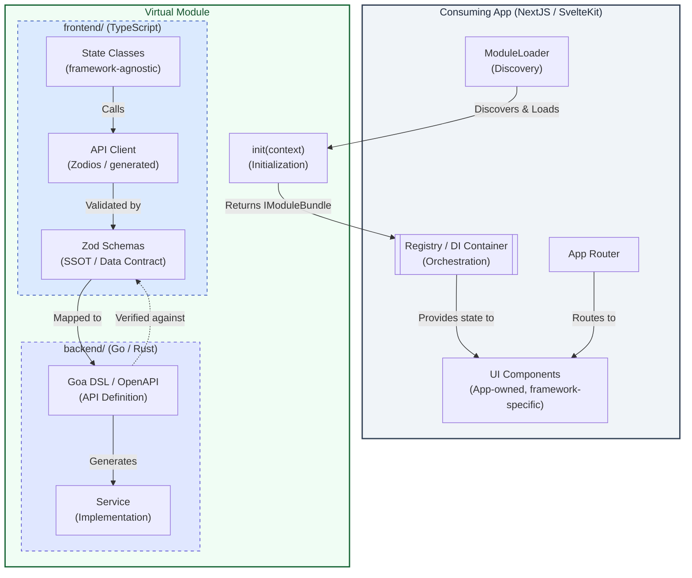

# Virtual Module Architecture

**Primary Reference**: [APPSHELL-ARCHITECTURE.md](APPSHELL-ARCHITECTURE.md) (Core System Design)

| Component            | Source Repository                                                         |
| :------------------- | :------------------------------------------------------------------------ |
| **Host Workspace**   | [reidlai/ta-workspace](https://github.com/reidlai/ta-workspace)           |
| **Portfolio Module** | [reidlai/portfolio-virtmod](https://github.com/reidlai/portfolio-virtmod) |
| **Watchlist Module** | [reidlai/watchlist-virtmod](https://github.com/reidlai/watchlist-virtmod) |

## Overview

A **Virtual Module** is a self-contained, independently-versioned package that provides:

- **`frontend/`** — pure TypeScript state management, Zod schemas, and a generated API client. **No UI kit or framework UI components.** The consuming application (NextJS, SvelteKit, Flutter) provides its own UI layer and imports state from this package.
- **`backend/`** — Go or Rust API implementation that satisfies the contract defined by the Zod schemas.

This separation means a single module's state and business logic can be consumed by **any supported frontend framework** without modification.



---

## Module Directory Structure

```
[module_name]/
├── frontend/                        # TypeScript state management (no UI kit)
│   ├── src/
│   │   ├── states/                  # State classes (Svelte 5 Runes or plain TS)
│   │   │   └── [Module]State.svelte.ts
│   │   ├── api-client/              # Generated Zodios client + Zod schemas
│   │   │   └── index.ts
│   │   ├── types/                   # Shared domain types
│   │   │   └── index.ts
│   │   └── index.ts                 # Module entry point (exports init + state)
│   ├── package.json
│   └── moon.yml
├── backend/                         # Go (or Rust) API implementation
│   ├── design/                      # Goa DSL (API contract)
│   ├── goa_gen/                     # Generated Goa transport layer
│   ├── pkg/                         # Service implementations (business logic)
│   ├── cmd/                         # Entrypoint binaries (if standalone)
│   ├── internal/                    # Internal-only helpers
│   ├── go.mod
│   └── moon.yml
└── moon.yml                         # Aggregated module tasks
```

**Dependency rule**: `frontend/` depends on the backend only via HTTP/gRPC (the API client). No circular dependencies.

---

## Component Boundaries

### 1. `frontend/` — State Management (No UI Kit)

**Role**: Business logic, reactive state, data validation, API integration.  
**Must not**: Import any UI framework components, UI kit libraries (ShadCN, Mantine, Tailwind components, etc.), or framework-specific rendering primitives.  
**May use**: Svelte 5 Runes (since Svelte compiles to plain JS and the state targets SvelteKit as primary consumer), Zod, Zodios, and standard TypeScript utilities.

#### State Class Pattern

```typescript
// frontend/src/states/[Module]State.svelte.ts
import { api } from '$lib/api-client';
import type { Item } from '../types';

export class [Module]State {
  data = $state<Item[]>([]);
  loading = $state(false);
  error = $state<string | null>(null);

  isReady = $derived(this.data.length > 0);

  async fetch() {
    this.loading = true;
    this.error = null;
    try {
      this.data = await api.listItems();
    } catch (e) {
      this.error = e instanceof Error ? e.message : 'Unknown error';
    } finally {
      this.loading = false;
    }
  }
}

export const [module]State = new [Module]State();
```

If the module must support **both** SvelteKit and NextJS without Svelte Runes:

```typescript
// frontend/src/states/[Module]State.ts  (plain TypeScript, no Runes)
import { api } from './api-client';
import type { Item } from './types';

type Subscriber = (state: [Module]StateSnapshot) => void;

export class [Module]State {
  private _data: Item[] = [];
  private _loading = false;
  private _subscribers: Subscriber[] = [];

  get data() { return this._data; }
  get loading() { return this._loading; }

  subscribe(fn: Subscriber) {
    this._subscribers.push(fn);
    return () => { this._subscribers = this._subscribers.filter(s => s !== fn); };
  }

  private notify() {
    const snap = { data: this._data, loading: this._loading };
    for (const fn of this._subscribers) fn(snap);
  }

  async fetch() {
    this._loading = true;
    this.notify();
    this._data = await api.listItems();
    this._loading = false;
    this.notify();
  }
}

export const [module]State = new [Module]State();
```

#### API Client & Schemas

```typescript
// frontend/src/api-client/index.ts
import { makeApi, Zodios } from '@zodios/core';
import { z } from 'zod';

export const ItemSchema = z.object({
  id: z.string(),
  symbol: z.string(),
  createdAt: z.string().datetime(),
});
export type Item = z.infer<typeof ItemSchema>;

const api = makeApi([
  {
    method: 'get',
    path: '/items',
    alias: 'listItems',
    response: z.array(ItemSchema),
  },
]);

export const apiClient = new Zodios('/api', api);
```

#### Module Entry Point

```typescript
// frontend/src/index.ts
import { [module]State } from './states/[Module]State.svelte';
import type { ModuleInit } from 'virtual-module-core';

export const init: ModuleInit = async (_context) => {
  return {
    id: '[module_name]',
    widgetDescriptors: [
      { id: '[module_name]-widget', title: '[Module] Widget', location: 'dashboard', size: 'medium' },
    ],
    state: {
      [module]State,
    },
    routes: [
      { path: '/[module_name]', widgetId: '[module_name]-widget' },
    ],
  };
};

// Also export state for direct import by consuming apps
export { [module]State } from './states/[Module]State.svelte';
export type { Item } from './api-client';
```

---

### 2. `backend/` — Go / Rust API

**Role**: Persistence, business logic, and contract fulfillment.  
**Must not**: Import frontend types or UI state.

#### Goa DSL (Go)

```go
// backend/design/design.go
var _ = Service("[module_name]", func() {
    Method("list", func() {
        Payload(func() {
            Attribute("user_id", String)
            Required("user_id")
        })
        Result(ArrayOf(Item))
        HTTP(func() {
            GET("/[module_name]")
            Header("user_id:X-User-ID")
        })
    })
})

var Item = Type("Item", func() {
    Attribute("id", String)
    Attribute("symbol", String)
    Attribute("created_at", String, func() { Format(FormatDateTime) })
    Required("id", "symbol", "created_at")
})
```

#### Service Implementation

```go
// backend/pkg/service.go
type [module]Svc struct {
    db     DB
    logger Logger
}

func New[Module]Service(db DB, logger Logger) *[module]Svc {
    return &[module]Svc{db: db, logger: logger}
}

func (s *[module]Svc) List(ctx context.Context, p *gen.ListPayload) ([]*gen.Item, error) {
    return s.db.Query(ctx, p.UserID)
}
```

---

## Integration into Consuming Apps

### SvelteKit Integration

Import state from the module's `frontend/` package and use it directly — Svelte 5 Runes are reactive without extra wiring.

```svelte
<!-- apps/sveltekit-appshell/src/lib/widgets/[Module]Widget.svelte -->
<script lang="ts">
  import { registry } from '$lib/registry';
  import type { [Module]State } from '@my-org/[module_name]-virtmod/frontend';

  const state = registry.getState<[Module]State>('[module]State');
  $effect(() => { state.fetch(); });
</script>

{#if state.loading}
  <p>Loading…</p>
{:else}
  {#each state.data as item}
    <div>{item.symbol}</div>
  {/each}
{/if}
```

Register the widget component in the app's widget map:

```typescript
// apps/sveltekit-appshell/src/lib/widgetRegistry.ts
import [Module]Widget from '$lib/widgets/[Module]Widget.svelte';

export const widgetComponentMap = {
  '[module_name]-widget': [Module]Widget,
};
```

### NextJS Integration

Use `useSyncExternalStore` to subscribe to the module's plain TypeScript state:

```typescript
// apps/nextjs-appshell/src/hooks/use[Module].ts
import { useSyncExternalStore } from 'react';
import { [module]State } from '@my-org/[module_name]-virtmod/frontend';

export function use[Module]() {
  const data = useSyncExternalStore(
    [module]State.subscribe,
    () => [module]State.data,
  );
  return { data, loading: [module]State.loading, fetch: [module]State.fetch };
}
```

```tsx
// apps/nextjs-appshell/src/components/[Module]Widget.tsx
'use client';
import { useEffect } from 'react';
import { use[Module] } from '../hooks/use[Module]';

export function [Module]Widget() {
  const { data, loading, fetch } = use[Module]();
  useEffect(() => { fetch(); }, []);

  if (loading) return <div>Loading…</div>;
  return (
    <ul>
      {data.map(item => <li key={item.id}>{item.symbol}</li>)}
    </ul>
  );
}
```

Register the widget component:

```typescript
// apps/nextjs-appshell/src/lib/widgetRegistry.tsx
import { [Module]Widget } from '@/components/[Module]Widget';

export const widgetComponentMap = {
  '[module_name]-widget': [Module]Widget,
};
```

### Flutter Integration

Flutter consumes the module's **backend API** directly (not the TypeScript `frontend/` package). Generate a Dart client from the module's OpenAPI spec:

```bash
# Generate Dart client from the module's OpenAPI spec
openapi-generator generate \
  -i modules/[module_name]/backend/goa_gen/http/openapi3.json \
  -g dart-dio \
  -o packages/[module_name]_client
```

```dart
// apps/flutter-appshell/lib/services/[module]_service.dart
import 'package:rxdart/rxdart.dart';
import 'package:[module_name]_client/[module_name]_client.dart';

class [Module]Service {
  final _client = [Module]Client();
  final _items$ = BehaviorSubject<List<Item>>.seeded([]);

  Stream<List<Item>> get items$ => _items$.stream;

  Future<void> fetch() async {
    final items = await _client.listItems();
    _items$.add(items);
  }

  void dispose() => _items$.close();
}
```

```dart
// apps/flutter-appshell/lib/widgets/[module]_widget.dart
import 'package:flutter/material.dart';
import '../services/[module]_service.dart';

class [Module]Widget extends StatelessWidget {
  final [Module]Service service;
  const [Module]Widget({required this.service});

  @override
  Widget build(BuildContext context) {
    return StreamBuilder<List<Item>>(
      stream: service.items$,
      builder: (context, snapshot) {
        if (!snapshot.hasData) return const CircularProgressIndicator();
        return ListView(
          children: snapshot.data!.map((item) => ListTile(title: Text(item.symbol))).toList(),
        );
      },
    );
  }
}
```

---

## Integration Model

### Git Submodule Integration

Virtual Modules are developed as **independent Git repositories** and integrated into the host workspace as Git submodules.

```bash
# Add module
git submodule add git@github.com:reidlai/[module_name]-virtmod.git modules/[module_name]
git submodule update --init --recursive

# Configure workspace files
# .moon/workspace.yml — add modules/[module_name]/frontend and modules/[module_name]/backend
# pnpm-workspace.yaml — add modules/[module_name]/frontend
# go.work — add ./modules/[module_name]/backend

pnpm install
moon sync
```

### Runtime Integration

Modules are **not** standalone services. They provide artifacts compiled into the host:

- **Backend**: The module's Go service is imported and compiled into the host server binary.
- **Frontend**: The `ModuleLoader` imports the module's `frontend/` package, calls `init()`, and the Registry stores the returned bundle. The consuming app's UI components then access state via the Registry.

---

## UI-First Development Workflow

This module follows a phased **UI-First** design philosophy. Backend implementation only begins after the data contract is validated in isolation.

### Step 1: Define Domain Types

```typescript
// frontend/src/types/index.ts
export interface Item {
  id: string;
  symbol: string;
  createdAt: string;
}
```

### Step 2: Create State Class with Mock Data

```typescript
// frontend/src/states/[Module]State.svelte.ts
export class [Module]State {
  data = $state<Item[]>([
    { id: '1', symbol: 'AAPL', createdAt: new Date().toISOString() }, // Mock
  ]);
  loading = $state(false);
}
```

### Step 3: Integrate into Consuming App for Validation

Import the state into the consuming SvelteKit or NextJS app. Validate UX with stakeholders using mock data — no backend required.

### Step 4: Define Zod Schemas (SSOT)

```typescript
// frontend/src/api-client/schemas.ts
export const ItemSchema = z.object({
  id: z.string(),
  symbol: z.string(),
  createdAt: z.string().datetime(),
});
```

### Step 5: Define Goa DSL in `backend/`

Map the Zod schema to a Goa design, ensuring type alignment.

### Step 6: Generate Backend Interface

```bash
moon run [module_name]-backend:goa-gen
```

### Step 7: Implement Service

```go
// backend/pkg/service.go — implement generated interface
```

### Step 8: Generate TypeScript API Client

```bash
moon run [module_name]-frontend:gen-client
# Reads backend/goa_gen/http/openapi3.json → writes frontend/src/api-client/index.ts
```

### Step 9: Replace Mock Data with Live API Client

```typescript
// frontend/src/states/[Module]State.svelte.ts — replace mock with api.listItems()
```

---

## App Architecture Constraints

### 1. No UI Kit in `frontend/`

The `frontend/` package MUST NOT import any UI component library. UI components live in the consuming app.

- Allowed: `zod`, `@zodios/core`, `svelte` (for Runes), standard TypeScript
- Prohibited: `shadcn-svelte`, `@radix-ui/*`, `@mantine/*`, Tailwind CSS component libraries, any rendering framework

### 2. Mockability

All external dependencies (host APIs, DB, auth) MUST be mockable:

- **Backend**: Services depend on interfaces, not concrete structs.
- **State classes**: Support an optional mock data mode for development without a live backend.

### 3. Dependency Injection

No hardcoded infrastructure instantiation in core logic:

- **Backend**: Use `New[Module]Service(logger, db)` factories.
- **Frontend**: Export state instances; the AppShell provides context via `init(context)`.

---

## Testing Strategy

### Unit Tests

```bash
# Test backend logic (no external services)
moon run [module_name]-backend:test

# Test state classes with mock API
moon run [module_name]-frontend:test
```

### Integration Tests

```bash
# Backend integration in the host server context
moon run go-server:test

# Frontend integration in the appshell context
moon run sveltekit-appshell:test
```

**Boundaries**:

- **Unit Tests**: Mock all host dependencies (DB, logger, shell context). Mock API responses for state class tests.
- **Integration Tests**: Use host test fixtures with real internal registry routing.

---

## Deployment

Virtual Modules produce **no independent artifacts**:

- **`backend/`**: Compiled into the host server binary via Go imports.
- **`frontend/`**: Bundled into the host frontend build via pnpm workspace imports.

### Release Process

1. Module changes are committed to the independent `[module_name]-virtmod` repository.
2. The host workspace updates the Git submodule reference.
3. Host CI rebuilds shell binaries/bundles with the new module code.
4. A single deployment of the host app includes all module updates.

---

## Security Model

The module inherits the host app's security posture:

- **Authentication**: Host's session middleware
- **Authorization**: Host's RBAC policies
- **Data Access**: Host's DB connection pool (injected via DI)
- **Network**: Host's TLS termination

See `threat_modelling/tm.py` for the PyTM model. The module assumes a trusted host environment with no direct external exposure.

---

## Migration Considerations

### From Standalone to Virtual Module

1. Remove `main.go` (backend) / standalone app entry (frontend).
2. Convert backend logic to factory pattern: `New[Module]Service(logger, db)`.
3. Remove any UI kit components from the shared state layer — move them to the consuming app.
4. Implement the `init()` entry point in `frontend/src/index.ts` to return `IModuleBundle`.

### Future Standalone Extraction

1. Add `main.go` / `cmd/` entrypoint and HTTP server setup.
2. Re-add DB migrations and auth middleware.
3. Create a standalone app that consumes the `frontend/` package instead of the Registry.
