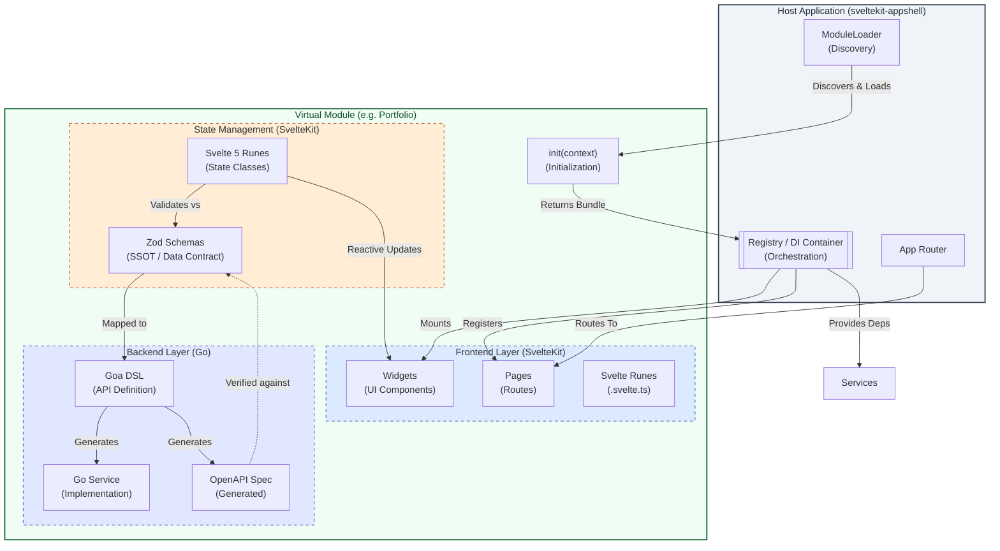

# Virtual Module Architecture

**Primary Reference**: [APPSHELL-ARCHITECTURE.md](docs/APPSHELL-ARCHITECTURE.md) (Core System Design)

| Component            | Source Repository                                                         |
| :------------------- | :------------------------------------------------------------------------ |
| **Host Workspace**   | [reidlai/ta-workspace](https://github.com/reidlai/ta-workspace)           |
| **Portfolio Module** | [reidlai/portfolio-virtmod](https://github.com/reidlai/portfolio-virtmod) |
| **Watchlist Module** | [reidlai/watchlist-virtmod](https://github.com/reidlai/watchlist-virtmod) |

## Overview

This document describes the **polyglot Virtual Module** pattern used to extend App Shell architecture. Based on the foundational principles defined in [APPSHELL-ARCHITECTURE.md](docs/APPSHELL-ARCHITECTURE.md), virtual modules (such as [Portfolio](https://github.com/reidlai/portfolio-virtmod) and [Watchlist](https://github.com/reidlai/watchlist-virtmod)) are developed as independent repositories and integrated as Git submodules. This architecture enables feature teams to build, test, and version modules independently while the host AppShell orchestrates them into a unified experience at runtime.

### Module Structure

Following the workspace standard defined in [`DEVELOPER-GUIDE.md`](https://github.com/reidlai/ta-workspace/blob/main/docs/DEVELOPER-GUIDE.md#architecture-summary):



```
[module_name]/
├── go/                              # Backend Layer (Goa)
│   ├── design/                      # Goa DSL (defines API contract)
│   ├── goa_gen/                     # Generated Goa code
│   ├── pkg/                         # Service implementations (Business Logic)
│   └── moon.yml                     # Go project tasks
├── sveltekit/                       # UI Layer (SvelteKit)
│   ├── src/
│   │   ├── lib/
│   │   │   ├── api-client/          # Generated Zodios API client
│   │   │   ├── components/ui/       # ShadCN Svelte components
│   │   │   ├── widgets/             # Reusable UI widgets (Registry-bound)
│   │   │   └── states/              # Svelte 5 Runes state classes
│   │   └── routes/                  # SvelteKit routes (Module-specific pages)
│   ├── package.json
│   └── moon.yml                     # Svelte project tasks
└── moon.yml                         # Module root aggregated tasks

Dependency Flow: sveltekit ← go (one-way, no circular dependencies)
```

**Key Principles**:

- **API client in `sveltekit/src/lib/api-client/`**: Generated Zodios client with Zod schemas
- **State Classes in `sveltekit/src/lib/states/`**: Use Svelte 5 Runes (`$state`, `$derived`) for reactive state management
- **RES Client Synchronization**: Modules can ingest a pre-authenticated `resClient` from the `AppShell` to enable real-time state synchronization via Resgate.

## Integration Model

### Git Submodule Integration

Virtual Modules are developed as **independent Git repositories** and integrated into the host platform ([reidlai/ta-workspace](https://github.com/reidlai/ta-workspace)) as Git submodules.

**Integration Steps**:

1. **Add as Submodule** (from workspace root):
   ```bash
   git submodule add git@github.com:reidlai/[module_name]-virtmod.git modules/[module_name]
   git submodule update --init --recursive
   ```

2. **Configure Workspace**:
   To ensure the host AppShell and build system can see the new module, updates are required in three key configuration files:
   - **`.moon/workspace.yml`**: Add the module's sub-projects to the `projects` map (e.g., `modules/[module_name]/go`, `modules/[module_name]/sveltekit`).
   - **`pnpm-workspace.yaml`**: Add the module's sveltekit path (e.g., `modules/[module_name]/sveltekit`) to include its packages in the pnpm workspace.
   - **`go.work`**: Add the backend path (e.g., `./modules/[module_name]/go`) to the Go workspace for cross-module development.

3. **Install & Sync**:
   ```bash
   pnpm install
   moon sync
   ```

### Runtime Integration (Module Registry)

Modules are **NOT** standalone services. They provide artifacts that are statically or dynamically integrated:
- **Backend**: Go services are instantiated and passed into the host server via Dependency Injection.
- **Frontend**: The `ModuleLoader` discovers the module entry point (`index.ts`), and the module's `init()` function registers its widgets, handlers, and routes with the **`Registry`**. During this phase, the AppShell can provide a shared `resClient` instance for real-time synchronization.

---

## Component Boundaries

The architecture follows a strict **UI-First** design flow: `UI (Svelte)` → `API Contract (Schema)` → `Reactive State (Svelte 5 Runes)` → `Implementation (Go)`.

### 1. Frontend Layer (SvelteKit)

**Role**: Presentation and User Interaction.
**Reactivity**: Uses **Svelte 5 Runes** for predictable, high-performance UI state.

#### State Class Pattern
Business logic and API integration lives in **State Classes** using Svelte 5 Runes (`$state`, `$derived`).

```typescript
// modules/[module_name]/sveltekit/src/lib/states/[Module]State.svelte.ts
import { api } from "$lib/api-client";

export class [Module]State {
  // Svelte 5 Reactive State
  data = $state<any>(null);
  loading = $state(false);
  error = $state<string | null>(null);

  // Derived state
  isReady = $derived(this.data !== null);

  async fetch() {
    this.loading = true;
    this.error = null;
    try {
      this.data = await api.get("/[module]");
    } catch (e) {
      this.error = e instanceof Error ? e.message : "Unknown error";
    } finally {
      this.loading = false;
    }
  }
}
export const [module]State = new [Module]State();
```

**Boundaries**:
- State classes integrate directly with the API client (Zodios).
- UI components use `$props()` to support Dependency Injection and testability.

### 2. API Client & Schemas (SvelteKit)

**Role**: Single Source of Truth (SSOT), Data Validation.
**Tooling**: Zod + Zodios.

The API client and schemas are colocated in the SvelteKit layer for simpler dependency management.

**Pattern**: SSOT + Zodios Client
- **`sveltekit/src/lib/api-client/`**: Contains the generated Zodios client with Zod schemas.
- **`sveltekit/src/lib/states/`**: Contains Svelte 5 Runes state classes that manage reactive state.

**Boundaries**:
- Validates all incoming data via Zod automatically through Zodios.
- State classes encapsulate API calls and reactive state management.

### 3. Backend Layer (Go)

**Role**: Persistence, Business Logic, and Contract Fulfillment.
**Tooling**: Goa.

The backend satisfies the API contract derived from the Shared Logic layer.

**Pattern**: Design-First with OpenAPI Verification
- **`go/design/`**: Defines the API and data types using Goa DSL (mapped from Zod schemas).
- **`go/pkg/`**: Implements the service interface generated by Goa.
- **OpenAPI Loop**: The generated `openapi3.json` is verified against the Zod schemas in the Shared Logic layer to ensure full contract alignment (Loop Closure).

**Boundaries**:
- No knowledge of the frontend; purely implements the transport-agnostic interface defined in the design.
- Persistence and infrastructure (logging, DB) are provided via Dependency Injection from the host AppShell.

## Dependency Management

### Go Dependencies

```go
// go.mod
module github.com/reidlai/ta-workspace/modules/portfolio/go

require (
    goa.design/goa/v3 v3.23.4
    // Host app provides: logger, DB, config
)
```

**Pattern**: Dependency Injection

- Module declares interfaces
- Host app provides implementations

### Node Dependencies

```json
// sveltekit/package.json
{
  "dependencies": {
    "@core/types": "workspace:*" // From host
  }
}
```

**Pattern**: Workspace Protocol

- Shared types via monorepo workspace
- No version conflicts

## Security Model

### Threat Surface

The module inherits the host app's security posture:

- **Authentication**: Host's session middleware
- **Authorization**: Host's RBAC policies
- **Data Access**: Host's DB connection pool
- **Network**: Host's TLS termination

### Threat Modeling

See `threat_modelling/tm.py` for PyTM model:

- Assumes trusted host environment
- No direct external exposure
- Data flows through host's API gateway

---

## UI-First Development Workflow

**Primary Reference**: [DEVELOPER-GUIDE.md](DEVELOPER-GUIDE.md)

This module follows a strictly phased **UI-First** design philosophy. Backend implementation only begins after UI behaviors and data contracts are validated in isolation.

### The 9-Step Sequence

#### Step 1: Create UI Components
- **Path**: `sveltekit/src/lib/widgets/[WidgetName].svelte`
- **Goal**: Build the UI using **ShadCN Svelte** and Svelte 5 `$state`. Use hardcoded local variables initially to focus on layout and UX.

#### Step 2: Create Local Types for Storybook
- **Path**: `sveltekit/src/lib/widgets/[WidgetName].types.ts`
- **Goal**: Define the interfaces required to drive the UI. This acts as the initial "Design Contract".

#### Step 3: Create Storybook Scenarios
- **Path**: `sveltekit/src/lib/widgets/[WidgetName].stories.ts`
- **Goal**: Create various scenarios (Loading, Empty, Data, Error) with sample data. Validate the component's look and feel with stakeholders.

#### Step 4: Define State Classes (Svelte 5 Runes)
- **Path**: `sveltekit/src/lib/states/[Module]State.svelte.ts`
- **Goal**: Define the state classes that will hold the data. Use `$state`, `$derived` to support SvelteKit's reactivity model.

#### Step 5: Create Goa Design DSL
- **Path**: `go/design/design.go`
- **Goal**: Formalize the design contract in Go. Define services, methods, and types using Goa DSL, ensuring they align with the requirements identified in Step 2.

#### Step 6: Generate API Server Interface
- **Command**: `moon run [module_name]-go:goa-gen`
- **Goal**: Use Goa to generate the transport layer and the service interface in Golang.

#### Step 7: Implement API Server
- **Path**: `go/pkg/service.go`
- **Goal**: Implement the business logic and persistence layer that satisfies the generated interface.

#### Step 8: Generate TypeScript API Client
- **Tooling**: Goa + Zodios
- **Path**: `sveltekit/src/lib/api-client/index.ts`
- **Goal**: Use the Goa-generated OpenAPI spec to generate a TypeScript client that supports **Zod schemas** and the **Zodios** API client. This ensures the frontend uses the exact same data contract as the backend.

#### Step 9: Integrate State Classes and Client
- **Path**: `sveltekit/src/lib/states/[Module]State.svelte.ts`
- **Goal**: Integrate the API client with state classes. The state class calls the API client, which validates results via Zod automatically, and performs any necessary **payload transformations** before exposing reactive state to UI components.

---

## App Architecture Constraints

### 1. Mockability

**Rule**: All external dependencies (Host APIs, DBs, Auth) MUST be mockable to support isolated development and testing.

- **Go**: Services must depend on **Interfaces**, not concrete structs. Use the Goa-generated interfaces to ensure transport independence.
- **State Classes**: State classes should support mock data mode for development without a live backend.
- **Svelte**: Components must receive data through `$props()` or state classes to facilitate Storybook testing.

### 2. Dependency Injection

**Rule**: No hardcoded instantiations of infrastructure clients within the core logic.

- **Pattern**: Use Service Factories (e.g., `New[Module]Service(logger, db, deps...)`) to inject dependencies at the AppShell entry point.
- **Frontend**: Register service instances with the **`Registry`** during the `init()` phase.

---

## Testing Strategy

### Unit Tests
Test each layer in isolation within the module directory.

```bash
# Test Go logic
moon run [module_name]-go:test

# Test UI Components and State Classes
moon run [module_name]-sveltekit:test
```

### Integration Tests
Test the module within the host AppShell context.

```bash
# Test backend integration in the shell
moon run go-server:test

# Test frontend integration in the shell
moon run sveltekit-appshell:test
```

**Boundaries**:
- **Unit Tests**: Mock all host dependencies (DB, logger, shell context).
- **Integration Tests**: Use host's test fixtures and real internal registry routing.

---

## Deployment

### Build Artifacts
Virtual Modules produce **no independent artifacts**. They are compiled/bundled into the host:

- **`go-server`**: The module's Go implementation is imported and compiled into the main server binary.
- **`sveltekit-appshell`**: The module's Svelte widgets and TypeScript logic are bundled into the shell's frontend build.

### Release Process
1. Module changes are committed to the independent `[module_name]-virtmod` repository.
2. The host workspace (`ta-workspace`) updates the Git submodule reference.
3. Host CI rebuilds the shell binaries/bundles with the new module code.
4. A single deployment of the host app includes all module updates.

---

## Migration Considerations

### From Standalone to Virtual Module
If migrating an existing service:
1. **Remove Main Entry**: Delete the `main.go`.
2. **Implement Factory**: Convert logic to the service factory pattern with interface-based DI.
3. **Externalize Infrastructure**: Remove DB schema ownership and auth middleware (rely on host injections).
4. **Register with Shell**: Implement the `init()` entry point to register widgets and routes.

### Future Standalone Extraction
If a module needs to become standalone:
1. **Add Main Entry**: Create a new `main.go` and HTTP server setup.
2. **Restore Infrastructure**: Re-add database migrations and auth middleware.
3. **Expose Directly**: Convert internal Registry-bound widgets/routes into standard standalone pages.
