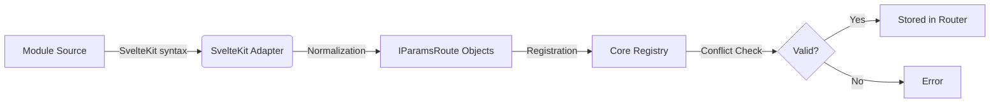
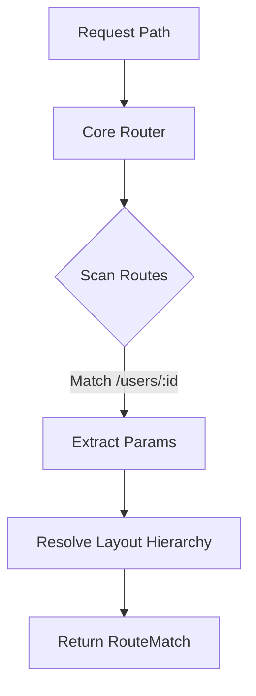

# Data Model: Framework-Agnostic Routing

**Feature**: Framework-Agnostic Module Routing
**Phase**: 1 (Design)
**Date**: 2026-01-10

## Core Entites (Generic)

### `IParamsRoute` (The Standard Schema)

**Purpose**: The canonical representation of a route in the Core system.

```typescript
export interface IParamsRoute {
  /**
   * The normalized URL pattern.
   * - Must start with `/`
   * - Uses `:param` for dynamic segments
   * - Uses `*` for wildcards
   * - Uses `:param?` for optional parameters
   */
  path: string;

  /**
   * The generic route type.
   * Framework-specific types should map to these or use 'other'.
   */
  type: "page" | "layout" | "error" | "api" | "other";

  /**
   * The component or handler function.
   * Opaque to the router (passed through to renderer).
   */
  component: any;

  /**
   * Extensible metadata for framework-specific logic.
   * e.g., { methods: ['GET', 'POST'], svelteKit: { file: '+page.svelte' } }
   */
  metadata?: Record<string, any>;
}
```

### `RouteMatch` (Result)

```typescript
export interface RouteMatch {
  route: IParamsRoute;
  params: Record<string, string>;

  /**
   * Ordered list of parent layout routes derived from path hierarchy.
   * Root -> Leaf
   */
  layouts: IParamsRoute[];
}
```

---

## Interfaces

### `IFrameworkAdapter`

**Purpose**: Contract for transforming module code into Standard Schema.

```typescript
export interface IFrameworkAdapter {
  /**
   * Identifies if this adapter can handle the given module.
   * e.g., checks for `sveltekit/` directory
   */
  detect(module: any): boolean;

  /**
   * Parses the module resources and returns standard routes.
   * Performs normalization (e.g., [id] -> :id).
   */
  parse(module: any): Promise<IParamsRoute[]>;
}
```

---

## Flows

### Adapter Pipeline



### Matching Flow (Generic)



## Validation & Normalization Rules

| Framework Concept | Adapter Input (e.g. Svelte) | Core Output (Normalized)      |
| :---------------- | :-------------------------- | :---------------------------- |
| Dynamic Param     | `/users/[id]`               | `/users/:id`                  |
| Rest Param        | `/docs/[...path]`           | `/docs/*` (or `/docs/:path*`) |
| Optional Param    | `/lang/[[code]]`            | `/lang/:code?`                |
| Route Group       | `/(app)/dashboard`          | `/dashboard`                  |
| Layout File       | `+layout.svelte`            | `type: 'layout'`              |
| Server File       | `+server.ts`                | `type: 'api'`                 |
