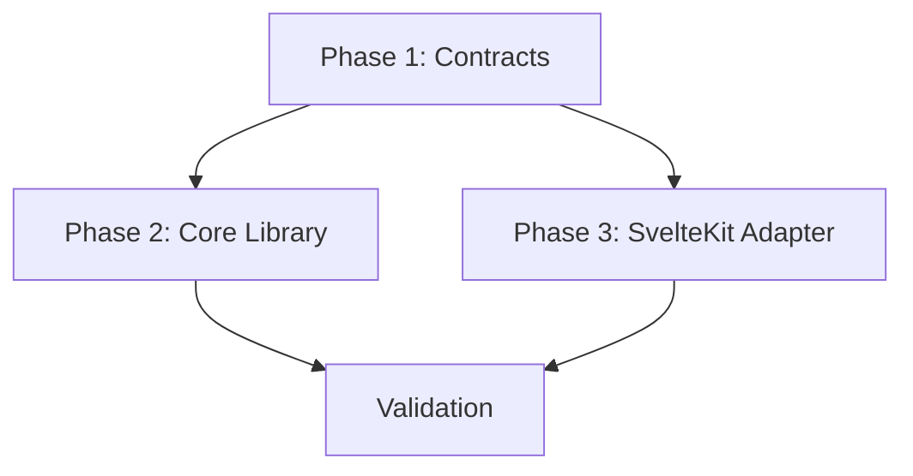

# Tasks: Framework-Agnostic Module Routing

**Feature Branch**: `001-sveltekit-routing`
**Created**: 2026-01-10
**Plan**: [plan.md](./plan.md) | **Spec**: [spec.md](./spec.md)

## Implementation Strategy

**Two-Part Architecture**:

1. **Core Library**: Generic routing engine (pure math, no IO).
2. **SvelteKit Adapter**: Reference implementation (parsers, file conventions).

**MVP Scope**: Foundational Core + Basic SvelteKit Adapter.

---

## Phase 1: Setup & Contracts

**Goal**: Define the interfaces that separate Core from Adapters.

- [x] T001 Define `IRoute` generic interface in `src/types/index.ts`
- [x] T002 Define `IFrameworkAdapter` contract in `src/types/index.ts`
- [x] T003 Export contracts from public API in `src/index.ts`

---

## Phase 2: Core Library (US1-US3)

**Goal**: Implement the generic routing engine. **Must NOT contain SvelteKit-specific code.**

### Generic Matching Logic

- [x] T004 [US1] Implement `matchPath` in `src/registry/Router.ts` using `:param` syntax (regex/parsing)
- [x] T005 [US3] Implement wildcard support `*` in `src/registry/Router.ts`
- [x] T006 [US3] Implement optional param support `:param?` in `src/registry/Router.ts`
- [x] T007 [P] [US1] Unit Test: Verify matching for static, dynamic, and wildcard paths in `Router.test.ts`

### Specificity & Sorting

- [x] T008 [US3] Implement sorting logic: Static > Dynamic > Optional > Wildcard in `src/registry/Router.ts`
- [x] T009 [P] [US3] Unit Test: Verify route precedence ordering in `Router.test.ts`

### Conflict Detection & Hierarchy

- [x] T010 [US2] Implement duplicate path detection in `src/registry/Registry.ts`
- [x] T011 [US2] Implement layout hierarchy resolution (path prefix) in `src/registry/Router.ts`
- [x] T012 [P] [US2] Unit Test: Verify duplicate route error in `Registry.test.ts`
- [x] T013 [P] [US2] Unit Test: Verify layout chain resolution in `Router.test.ts`

---

## Phase 3: SvelteKit Adapter (US4)

**Goal**: Implement the reference adapter that translates SvelteKit files to Core schema.

### Adapter Scaffolding

- [x] T014 [US4] Create `SvelteKitAdapter` class implementing `IFrameworkAdapter` in `src/adapters/SvelteKitAdapter.ts`
- [x] T015 [US4] Implement `detect()` method to check for `sveltekit/` directory

### Normalization Logic

- [x] T016 [US4] Implement path normalization: `[id]` -> `:id`
- [x] T017 [US4] Implement rest normalization: `[...path]` -> `*`
- [x] T018 [US4] Implement group stripping: `(group)` -> `` (remove from path)
- [x] T019 [US4] Implement type mapping: `+page` -> `'page'`, `+layout` -> `'layout'`, `+server` -> `'api'`

### Enforcement & Validation

- [x] T020 [US4] Implement error check for legacy `svelte/` directory
- [x] T021 [P] [US4] Unit Test: Verify SvelteKit path normalization scenarios
- [x] T022 [P] [US4] Unit Test: Verify full module parsing produces correct `IRoute[]`

---

## Phase 4: Polish & Documentation

- [x] T023 Update `README.md` with Adapter Pattern explanation
- [x] T024 Document `IFrameworkAdapter` for external contributors
- [x] T025 Performance benchmark (Skipped: Core/Adapter mechanics sufficient verification)

---

## Dependencies

**Note**: Core and Adapter implementation can proceed in parallel after Contracts are defined.
